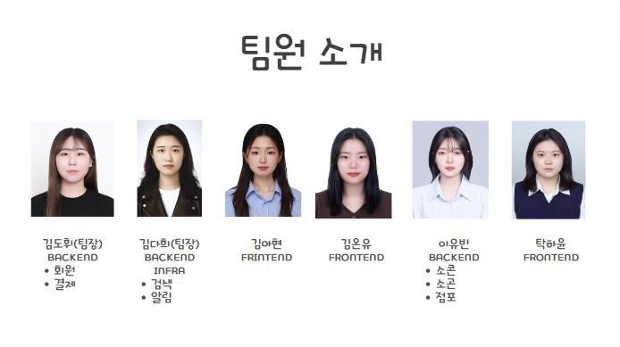

# 🐢 NFTicket - 티켓의 추억을 부여하다


## NFTicket 링크(PC 화면) : [https://nfticket.plus](https://nfticket.plus/)
## 소개 영상 보기 : [UCC 링크](https://youtu.be/lelttBR33Qo)

## 💜 프로젝트 진행 기간
2022.02.21(월) ~ 2022.04.08(금) (46일간 진행)  
SSAFY 6기 2학기 블록체인 특화 프로젝트 - NFTicket

</br>

## 🎵 NFTicket - 배경
공연이 끝난 뒤, 누군가와의 혹은 그 순간 나만의 소중한 추억이 담긴 티켓이 사라지는 것이 아쉽지 않으셨나요? 모아두고 싶어도 아름답지 않아 결국 사라지는 추억들.

수집가처럼 앨범을 준비하고 일상을 기록하기는 힘들지만 마음만큼은, 그 순간의 추억을 간직하고 싶은 당신을 위해 준비했습니다.
</br>

## 💜 NFTicket - 개요
*- 당신의 추억의 조각을 기록하고 소유할 수 있도록 -*

**NFTicket**은 당신의 추억이 담긴 티켓을 기록하고 소유할 수 있는 NFT로 만들어 드리는 NFT 기반 블록체인 티켓 거래 시스템입니다.

블록체인 기술을 이용해 대체 불가능 한 나만의 티켓을 만들고, 추억을 담아, 소유할 수 있는 NFT 기반 티켓 예매 및 거래 서비스를 제공합니다.

나에게 특별한 가치가 있는 티켓, 나만의 개성을 담은 티켓을 만들어 다른 사람에게 뽐낼 수 있는 커뮤니티 기능을 제공합니다.

특별한 추억이 담긴 티켓을 거래함으로써 그 가치를 증명하고 인기 있는 티켓을 수집하고 소유 할 수 있습니다.
</br>

## 💜 주요 기능
---
- ### 공연 관리
    - 블록체인 기반의 안전한 공연 관리 시스템을 통해 당신의 공연을 등록해 보세요
    - 공연 기획이 부담스러운 인디 뮤지션들도 수수료 걱정 없이 공정하고 투명한 플랫폼에서 공연 정보와 일정을 관리할 수 있습니다.
    - 인기 있는 공연의 골칫거리 "암표", NFTicket에서 암표를 추적하고 리셀 정책을 설정하여 건전한 리셀 시장을 형성할 수 있습니다.
      <br/>
- ### 공연 예매
    - 블록체인을 통해 공연을 예매하고, 당신의 티켓을 소장해보세요.
    - 스마트 컨트랙트를 통해 중개 시스템(Middle-man) 없이도 정당하게 나의 티켓을 예매할 수 있습니다.
    - 비대면 온라인 공연 등에도 블록체인 네트워크를 통해 티켓을 소유한 사람만 접속하도록 할 수 있습니다.
      <br/>
- ### 티켓 꾸미기
    - 공연이 끝난 뒤에도 사라지지 않고 당신의 추억을 담은 메세지나 스티커를 붙여 나만의 티켓을 만들 수 있습니다.
      <br/>
- ### 스마트 컨트랙트에서 거래
    - 이더리움 네트워크 내 스마트 컨트랙트를 통해 NFT 토큰(티켓) 거래
    - middle-man에 대한 의존성 제거
    - 이더리움 네트워크 내 참여 노드들에 의해 거래 검증
      </br>

## ✔ 주요 기술
---

* **Mobile Operating Systems**<br/>
  

* **Languages and Frameworks**<br/>
   

* **Database and Caching**<br/>
    

* **Development and Deployment Tools**<br/>
     

* **Cloud Storage, Cloud Message**<br/>

* **Web Server and Infrastructure**<br/>
    

* **Design and Project Management**<br/>
    

* **Environments**<br/>
   

## ✔ 프로젝트 구조
---


## ✔ 프로젝트 파일 구조
---
### Frontend

```
├── README.md
├── analysis_options.yaml
├── android
│   ├── app
│   │   ├── build.gradle
│   │   └── src
│   │       ├── debug
│   │       │   └── AndroidManifest.xml
│   │       ├── main
│   │       │   ├── AndroidManifest.xml
│   │       │   ├── ic_launcher-playstore.png
│   │       │   ├── java
│   │       │   │   └── site
│   │       │   │       └── boongbang
│   │       │   │           └── socon
│   │       │   │               └── MainActivity.java
│   │       │   ├── kotlin
│   │       │   │   └── site
│   │       │   │       └── boongbang
│   │       │   │           └── frontend
│   │       │   │               └── MainActivity.kt
│   │       │   └── res
│   │       │       ├── drawable
│   │       │       │   └── launch_background.xml
│   │       │       ├── drawable-v21
│   │       │       │   └── launch_background.xml
│   │       │       ├── mipmap-anydpi-v26
│   │       │       │   ├── ic_launcher.xml
│   │       │       │   └── ic_launcher_round.xml
│   │       │       ├── mipmap-hdpi
│   │       │       │   ├── ic_launcher.webp
│   │       │       │   ├── ic_launcher_foreground.webp
│   │       │       │   └── ic_launcher_round.webp
│   │       │       ├── mipmap-mdpi
│   │       │       │   ├── ic_launcher.webp
│   │       │       │   ├── ic_launcher_foreground.webp
│   │       │       │   └── ic_launcher_round.webp
│   │       │       ├── mipmap-xhdpi
│   │       │       │   ├── ic_launcher.webp
│   │       │       │   ├── ic_launcher_foreground.webp
│   │       │       │   └── ic_launcher_round.webp
│   │       │       ├── mipmap-xxhdpi
│   │       │       │   ├── ic_launcher.webp
│   │       │       │   ├── ic_launcher_foreground.webp
│   │       │       │   └── ic_launcher_round.webp
│   │       │       ├── mipmap-xxxhdpi
│   │       │       │   ├── ic_launcher.webp
│   │       │       │   ├── ic_launcher_foreground.webp
│   │       │       │   └── ic_launcher_round.webp
│   │       │       ├── values
│   │       │       │   ├── colors.xml
│   │       │       │   ├── ic_launcher_background.xml
│   │       │       │   └── styles.xml
│   │       │       └── values-night
│   │       │           └── styles.xml
│   │       └── profile
│   │           └── AndroidManifest.xml
│   ├── build.gradle
│   ├── gradle
│   │   └── wrapper
│   │       └── gradle-wrapper.properties
│   ├── gradle.properties
│   └── settings.gradle
├── assets
│   ├── fonts
│   │   ├── bagelFatOne
│   │   │   └── BagelFatOne-Regular.ttf
│   │   └── pretendard
│   │       ├── Pretendard-Black.otf
│   │       ├── Pretendard-Bold.otf
│   │       ├── Pretendard-ExtraBold.otf
│   │       ├── Pretendard-ExtraLight.otf
│   │       ├── Pretendard-Light.otf
│   │       ├── Pretendard-Medium.otf
│   │       ├── Pretendard-Regular.otf
│   │       ├── Pretendard-SemiBold.otf
│   │       └── Pretendard-Thin.otf
│   ├── icons
│   │   ├── arrow_back.svg
│   │   ├── avatar.svg
│   │   ├── calendar.svg
│   │   ├── filter.svg
│   │   ├── heart_empty.svg
│   │   ├── heart_fill.svg
│   │   ├── home.svg
│   │   ├── minus_btn.svg
│   │   ├── notifications.svg
│   │   ├── plus_btn.svg
│   │   └── search.svg
│   └── images
│       ├── backgroundImg_1.JPG
│       ├── backgroundImg_2.png
│       ├── bukjeokMarker.png
│       ├── osou.jpg
│       ├── sogonMarker.png
│       ├── sogumbbang.png
│       └── sugeunMarker.png
├── devtools_options.yaml
├── frontend.txt
├── lib
│   ├── firebase_options.dart
│   ├── main.dart
│   ├── models
│   │   ├── business_owner.dart
│   │   ├── location.dart
│   │   ├── locations.dart
│   │   ├── mystore_detail_menu.dart
│   │   ├── mystore_detail_menu_list_model.dart
│   │   ├── mystore_lists_model.dart
│   │   ├── notification.dart
│   │   ├── place_params.dart
│   │   ├── product_detail_model.dart
│   │   ├── socon_add.dart
│   │   ├── socon_book.dart
│   │   ├── socon_card.dart
│   │   ├── sogon_detail.dart
│   │   ├── sogon_place.dart
│   │   ├── sogon_register.dart
│   │   ├── store.dart
│   │   ├── store_register_model.dart
│   │   └── user.dart
│   ├── provider
│   │   ├── Address.dart
│   │   └── Boss_provider.dart
│   ├── routes
│   │   ├── router.dart
│   │   └── tab_routes.dart
│   ├── services
│   │   ├── auth_service.dart
│   │   ├── boss_verification_service.dart
│   │   ├── image_manager_service.dart
│   │   ├── my_socon_service.dart
│   │   ├── mystore_detail_menu_list_service.dart
│   │   ├── mystore_lists_service.dart
│   │   ├── notifications
│   │   │   ├── background_location_service.dart
│   │   │   ├── background_message_handler.dart
│   │   │   └── firebase_messaging_service.dart
│   │   ├── payment_service.dart
│   │   ├── permission_handler.dart
│   │   ├── qr_publishing_service.dart
│   │   ├── sogon_service.dart
│   │   ├── store_register_service.dart
│   │   └── stores_service.dart
│   ├── utils
│   │   ├── api
│   │   │   ├── api_utils.dart
│   │   │   └── users
│   │   │       └── fetch_boss_data.dart
│   │   ├── colors.dart
│   │   ├── firebase_utils.dart
│   │   ├── fontSizes.dart
│   │   ├── icon_paths.dart
│   │   ├── icons.dart
│   │   ├── location
│   │   │   ├── location_callback_handler.dart
│   │   │   └── location_service_repository.dart
│   │   ├── responsive_utils.dart
│   │   ├── result_msg_type.dart
│   │   ├── string_utils.dart
│   │   └── toast_utils.dart
│   ├── viewmodels
│   │   ├── boss_verification_view_model.dart
│   │   ├── login_state_view_model.dart
│   │   ├── menu.dart
│   │   ├── my_socon_view_model.dart
│   │   ├── mystore_detail_menu_list_view_model.dart
│   │   ├── notification_view_model.dart
│   │   ├── payment_verification_view_model.dart
│   │   ├── qr_generate_view_model.dart
│   │   ├── sign_in_view_model.dart
│   │   ├── sign_up_view_model.dart
│   │   ├── socon_coupon_view_model.dart
│   │   ├── sogon_view_model.dart
│   │   ├── store_product_view_model.dart
│   │   ├── store_register_view_model.dart
│   │   ├── store_socon_card_view_model.dart
│   │   └── stores_view_model.dart
│   └── views
│       ├── atoms
│       │   ├── bottom_bar.dart
│       │   ├── bottom_sheet.dart
│       │   ├── buttons.dart
│       │   ├── checkbox.dart
│       │   ├── dropdown.dart
│       │   ├── icon_loader.dart
│       │   ├── image_card.dart
│       │   ├── image_loader.dart
│       │   ├── input_form.dart
│       │   ├── inputs.dart
│       │   ├── modal.dart
│       │   ├── qr_code.dart
│       │   ├── search_box.dart
│       │   ├── socon_menu_management.dart
│       │   ├── socon_storesocon.dart
│       │   ├── switch.dart
│       │   ├── tab.dart
│       │   ├── tag_icon.dart
│       │   ├── text_area.dart
│       │   └── toast.dart
│       ├── modules
│       │   ├── add_menu_card.dart
│       │   ├── app_bar.dart
│       │   ├── cards
│       │   │   ├── detail_info_card.dart
│       │   │   └── publish_socon_card.dart
│       │   ├── fail_card.dart
│       │   ├── menu_detail_top_card.dart
│       │   ├── my_store_analysis.dart
│       │   ├── my_store_lists.dart
│       │   ├── mystore_menu_card.dart
│       │   ├── mystore_menu_management.dart
│       │   ├── mystore_rigister_menu_lists.dart
│       │   ├── place_list.dart
│       │   ├── place_list_card.dart
│       │   ├── plus_minus_btn.dart
│       │   ├── search_module.dart
│       │   ├── socon_coupon.dart
│       │   ├── socon_mysocon.dart
│       │   ├── socon_storesocon.dart
│       │   ├── store_detail_top_card.dart
│       │   ├── store_top_card.dart
│       │   └── success_card.dart
│       ├── payments
│       │   └── buy_socon_payment.dart
│       └── screens
│           ├── bossVerification
│           │   ├── boss_verification.dart
│           │   ├── boss_verification_fail_screen.dart
│           │   └── boss_verification_success_screen.dart
│           ├── contact
│           │   ├── contact_fail_screen.dart
│           │   ├── contact_screen.dart
│           │   └── contact_sucess_screen.dart
│           ├── kpostal_screen.dart
│           ├── myStore
│           │   ├── product_register_toast.dart
│           │   ├── publish_socon_screen.dart
│           │   ├── search_address.dart
│           │   ├── store_detail_screen.dart
│           │   ├── store_product_register.dart
│           │   ├── store_register_success_screen.dart
│           │   ├── store_register_view.dart
│           │   └── temp_store_register_view.dart
│           ├── my_info_screen.dart
│           ├── my_store_list_screen.dart
│           ├── nearby_info_screen.dart
│           ├── payment
│           │   ├── approval_fail_screen.dart
│           │   ├── approval_screen.dart
│           │   └── approval_success_screen.dart
│           ├── sign_in_screen.dart
│           ├── sign_up_screen.dart
│           ├── soconBook
│           │   ├── socon_book_detail_screen.dart
│           │   └── socon_book_screen.dart
│           ├── sogon
│           │   ├── sogon_detail_screen.dart
│           │   └── sogon_register_screen.dart
│           ├── sogon_main_screen.dart
│           ├── stores
│           │   ├── buy_menu_screen.dart
│           │   └── store_detail.dart
│           └── webView
│               └── web_view_screen.dart
├── linux
│   └── flutter
│       ├── generated_plugin_registrant.cc
│       └── generated_plugins.cmake
├── macos
│   └── Flutter
│       └── GeneratedPluginRegistrant.swift
├── pubspec.lock
├── pubspec.yaml
├── test
│   └── widget_test.dart
└── windows
    └── flutter
        ├── generated_plugin_registrant.cc
        └── generated_plugins.cmake
```

### Backend
**전체 구조**
```
├── auth
├── config
├── eureka
├── gateway
├── notification
├── payment
├── socon
├── user
└── utils
```
각 프로젝트는 다음과 같은 도메인 구조로 구성

```
├── Dockerfile
├── build
│   ├── classes
│   │   └── java
│   │       └── main
│   │           └── site
│   │               └── soconsocon
│   │                   └── socon
│   │                       ├── SoconApplication.class
│   │                       ├── global
│   │                       │   ├── GeoUtils.class
│   │                       │   ├── config
│   │                       │   │   ├── ESConfig.class
│   │                       │   │   ├── QueryDslConfig.class
│   │                       │   │   └── RedisConfig.class
│   │                       │   ├── domain
│   │                       │   │   └── ErrorCode.class
│   │                       │   └── exception
│   │                       │       ├── GlobalExceptionHandler.class
│   │                       │       └── SoconException.class
│   │                       ├── search
│   │                       │   ├── controller
│   │                       │   │   └── SearchController.class
│   │                       │   ├── domain
│   │                       │   │   ├── document
│   │                       │   │   │   ├── StoreDocument$StoreDocumentBuilder.class
│   │                       │   │   │   └── StoreDocument.class
│   │                       │   │   └── dto
│   │                       │   │       ├── common
│   │                       │   │       │   ├── SearchType.class
│   │                       │   │       │   └── SortType.class
│   │                       │   │       ├── request
│   │                       │   │       │   ├── SearchRequest.class
│   │                       │   │       │   ├── StoreCreateDocument$StoreCreateDocumentBuilder.class
│   │                       │   │       │   ├── StoreCreateDocument.class
│   │                       │   │       │   └── StoreNearMe.class
│   │                       │   │       └── response
│   │                       │   │           ├── FoundStoreInfo$FoundStoreInfoBuilder.class
│   │                       │   │           └── FoundStoreInfo.class
│   │                       │   ├── exception
│   │                       │   │   ├── SearchErrorCode.class
│   │                       │   │   └── SearchException.class
│   │                       │   ├── repository
│   │                       │   │   └── elasticsearch
│   │                       │   │       ├── CustomSearchRepository.class
│   │                       │   │       ├── CustomSearchRepositoryImpl.class
│   │                       │   │       └── SearchRepository.class
│   │                       │   └── service
│   │                       │       └── SearchService.class
│   │                       ├── sogon
│   │                       │   ├── controller
│   │                       │   │   └── SogonController.class
│   │                       │   ├── domain
│   │                       │   │   ├── dto
│   │                       │   │   │   ├── feign
│   │                       │   │   │   │   ├── FcmMessage$FcmMessageBuilder.class
│   │                       │   │   │   │   └── FcmMessage.class
│   │                       │   │   │   ├── request
│   │                       │   │   │   │   ├── AddCommentRequest.class
│   │                       │   │   │   │   ├── AddSogonRequest.class
│   │                       │   │   │   │   └── GetSogonListRequest.class
│   │                       │   │   │   └── response
│   │                       │   │   │       ├── CommentListResponse$CommentListResponseBuilder.class
│   │                       │   │   │       ├── CommentListResponse.class
│   │                       │   │   │       ├── CommentResponse$CommentResponseBuilder.class
│   │                       │   │   │       ├── CommentResponse.class
│   │                       │   │   │       ├── GetSogonListResponse$GetSogonListResponseBuilder.class
│   │                       │   │   │       ├── GetSogonListResponse.class
│   │                       │   │   │       ├── SogonListResponse$SogonListResponseBuilder.class
│   │                       │   │   │       ├── SogonListResponse.class
│   │                       │   │   │       ├── SogonResponse$SogonResponseBuilder.class
│   │                       │   │   │       └── SogonResponse.class
│   │                       │   │   └── entity
│   │                       │   │       └── jpa
│   │                       │   │           ├── Comment$CommentBuilder.class
│   │                       │   │           ├── Comment.class
│   │                       │   │           ├── QComment.class
│   │                       │   │           ├── QSogon.class
│   │                       │   │           ├── Sogon$SogonBuilder.class
│   │                       │   │           └── Sogon.class
│   │                       │   ├── exception
│   │                       │   │   ├── SogonErrorCode.class
│   │                       │   │   └── SogonException.class
│   │                       │   ├── feign
│   │                       │   │   └── NotificationFeignClient.class
│   │                       │   ├── repository
│   │                       │   │   └── jpa
│   │                       │   │       ├── CommentRepository.class
│   │                       │   │       └── SogonRepository.class
│   │                       │   └── service
│   │                       │       └── SogonService.class
│   │                       └── store
│   │                           ├── controller
│   │                           │   ├── IssueApiController.class
│   │                           │   ├── SoconApiController.class
│   │                           │   └── StoreApiController.class
│   │                           ├── domain
│   │                           │   ├── dto
│   │                           │   │   ├── request
│   │                           │   │   │   ├── AddBusinessNumberRequest.class
│   │                           │   │   │   ├── AddIssueRequest.class
│   │                           │   │   │   ├── AddItemRequest.class
│   │                           │   │   │   ├── AddMySoconRequest.class
│   │                           │   │   │   ├── AddStoreRequest.class
│   │                           │   │   │   ├── BusinessHourRequest.class
│   │                           │   │   │   ├── ChargeRequest$ChargeRequestBuilder.class
│   │                           │   │   │   ├── ChargeRequest.class
│   │                           │   │   │   ├── IndexRequest$IndexRequestBuilder.class
│   │                           │   │   │   ├── IndexRequest.class
│   │                           │   │   │   ├── RoleRequest$RoleRequestBuilder.class
│   │                           │   │   │   ├── RoleRequest.class
│   │                           │   │   │   ├── SoconBookSearchRequest$SoconBookSearchRequestBuilder.class
│   │                           │   │   │   ├── SoconBookSearchRequest.class
│   │                           │   │   │   ├── StoreAnalysisRequest$StoreAnalysisRequestBuilder.class
│   │                           │   │   │   ├── StoreAnalysisRequest.class
│   │                           │   │   │   ├── UpdateClosedPlannedRequest.class
│   │                           │   │   │   ├── UpdateStoreInfoRequest.class
│   │                           │   │   │   ├── WeeklyRequest$WeeklyRequestBuilder.class
│   │                           │   │   │   └── WeeklyRequest.class
│   │                           │   │   └── response
│   │                           │   │       ├── BusinessHourResponse$BusinessHourResponseBuilder.class
│   │                           │   │       ├── BusinessHourResponse.class
│   │                           │   │       ├── FavoriteStoresListResponse$FavoriteStoresListResponseBuilder.class
│   │                           │   │       ├── FavoriteStoresListResponse.class
│   │                           │   │       ├── GetBusinessNumberListResponse$GetBusinessNumberListResponseBuilder.class
│   │                           │   │       ├── GetBusinessNumberListResponse.class
│   │                           │   │       ├── IssueInfoResponse$IssueInfoResponseBuilder.class
│   │                           │   │       ├── IssueInfoResponse.class
│   │                           │   │       ├── IssueListResponse$IssueListResponseBuilder.class
│   │                           │   │       ├── IssueListResponse.class
│   │                           │   │       ├── IssuedAnalysisListResponse$IssuedAnalysisListResponseBuilder.class
│   │                           │   │       ├── IssuedAnalysisListResponse.class
│   │                           │   │       ├── ItemListResponse$ItemListResponseBuilder.class
│   │                           │   │       ├── ItemListResponse.class
│   │                           │   │       ├── ItemResponse$ItemResponseBuilder.class
│   │                           │   │       ├── ItemResponse.class
│   │                           │   │       ├── SalesAnalysisResponse$SalesAnalysisResponseBuilder.class
│   │                           │   │       ├── SalesAnalysisResponse.class
│   │                           │   │       ├── SalesListResponse$SalesListResponseBuilder.class
│   │                           │   │       ├── SalesListResponse.class
│   │                           │   │       ├── SoconInfoResponse$SoconInfoResponseBuilder.class
│   │                           │   │       ├── SoconInfoResponse.class
│   │                           │   │       ├── SoconListResponse$SoconListResponseBuilder.class
│   │                           │   │       ├── SoconListResponse.class
│   │                           │   │       ├── StoreAnalysisResponse$StoreAnalysisResponseBuilder.class
│   │                           │   │       ├── StoreAnalysisResponse.class
│   │                           │   │       ├── StoreInfoResponse$StoreInfoResponseBuilder.class
│   │                           │   │       ├── StoreInfoResponse.class
│   │                           │   │       ├── StoreListResponse$StoreListResponseBuilder.class
│   │                           │   │       ├── StoreListResponse.class
│   │                           │   │       ├── WeeklyAnalysisResponse$WeeklyAnalysisResponseBuilder.class
│   │                           │   │       └── WeeklyAnalysisResponse.class
│   │                           │   └── entity
│   │                           │       ├── feign
│   │                           │       │   ├── Member$MemberBuilder.class
│   │                           │       │   └── Member.class
│   │                           │       ├── jpa
│   │                           │       │   ├── BusinessHour.class
│   │                           │       │   ├── BusinessRegistration$BusinessRegistrationBuilder.class
│   │                           │       │   ├── BusinessRegistration.class
│   │                           │       │   ├── FavStore$FavStoreBuilder.class
│   │                           │       │   ├── FavStore.class
│   │                           │       │   ├── Issue$IssueBuilder.class
│   │                           │       │   ├── Issue.class
│   │                           │       │   ├── Item$ItemBuilder.class
│   │                           │       │   ├── Item.class
│   │                           │       │   ├── QBusinessHour.class
│   │                           │       │   ├── QBusinessRegistration.class
│   │                           │       │   ├── QFavStore.class
│   │                           │       │   ├── QIssue.class
│   │                           │       │   ├── QItem.class
│   │                           │       │   ├── QSocon.class
│   │                           │       │   ├── QStore.class
│   │                           │       │   ├── Socon$SoconBuilder.class
│   │                           │       │   ├── Socon.class
│   │                           │       │   ├── Store$StoreBuilder.class
│   │                           │       │   └── Store.class
│   │                           │       └── redis
│   │                           │           ├── SoconRedis$SoconRedisBuilder.class
│   │                           │           └── SoconRedis.class
│   │                           ├── exception
│   │                           │   ├── StoreErrorCode.class
│   │                           │   └── StoreException.class
│   │                           ├── feign
│   │                           │   └── FeignServiceClient.class
│   │                           ├── repository
│   │                           │   ├── jpa
│   │                           │   │   ├── BusinessHourRepository.class
│   │                           │   │   ├── BusinessRegistrationRepository.class
│   │                           │   │   ├── FavStoreRepository.class
│   │                           │   │   ├── IssueRepository.class
│   │                           │   │   ├── ItemRepository.class
│   │                           │   │   ├── SoconRepository.class
│   │                           │   │   └── StoreRepository.class
│   │                           │   └── redis
│   │                           │       └── SoconRedisRepository.class
│   │                           ├── scheduler
│   │                           │   └── StoreScheduler.class
│   │                           └── service
│   │                               ├── IssueService.class
│   │                               ├── ItemService.class
│   │                               ├── SoconRedisService.class
│   │                               ├── SoconService.class
│   │                               ├── StoreService$1.class
│   │                               ├── StoreService$2.class
│   │                               └── StoreService.class
│   ├── generated
│   │   └── sources
│   │       ├── annotationProcessor
│   │       │   └── java
│   │       │       └── main
│   │       │           └── site
│   │       │               └── soconsocon
│   │       │                   └── socon
│   │       │                       ├── sogon
│   │       │                       │   └── domain
│   │       │                       │       └── entity
│   │       │                       │           └── jpa
│   │       │                       │               ├── QComment.java
│   │       │                       │               └── QSogon.java
│   │       │                       └── store
│   │       │                           └── domain
│   │       │                               └── entity
│   │       │                                   └── jpa
│   │       │                                       ├── QBusinessHour.java
│   │       │                                       ├── QBusinessRegistration.java
│   │       │                                       ├── QFavStore.java
│   │       │                                       ├── QIssue.java
│   │       │                                       ├── QItem.java
│   │       │                                       ├── QSocon.java
│   │       │                                       └── QStore.java
│   │       └── headers
│   │           └── java
│   │               └── main
│   ├── resources
│   │   └── main
│   │       └── application.yml
│   └── tmp
│       └── compileJava
│           ├── compileTransaction
│           │   ├── backup-dir
│           │   └── stash-dir
│           │       └── CustomSearchRepositoryImpl.class.uniqueId0
│           └── previous-compilation-data.bin
├── build.gradle
├── docker-compose.yml
├── gradle
│   └── wrapper
│       ├── gradle-wrapper.jar
│       └── gradle-wrapper.properties
├── gradle.properties
├── gradlew
├── gradlew.bat
├── settings.gradle
└── src
    ├── main
    │   ├── java
    │   │   └── site
    │   │       └── soconsocon
    │   │           └── socon
    │   │               ├── SoconApplication.java
    │   │               ├── global
    │   │               │   ├── GeoUtils.java
    │   │               │   ├── config
    │   │               │   │   ├── ESConfig.java
    │   │               │   │   ├── QueryDslConfig.java
    │   │               │   │   └── RedisConfig.java
    │   │               │   ├── domain
    │   │               │   │   └── ErrorCode.java
    │   │               │   └── exception
    │   │               │       ├── GlobalExceptionHandler.java
    │   │               │       └── SoconException.java
    │   │               ├── search
    │   │               │   ├── controller
    │   │               │   │   └── SearchController.java
    │   │               │   ├── domain
    │   │               │   │   ├── document
    │   │               │   │   │   └── StoreDocument.java
    │   │               │   │   └── dto
    │   │               │   │       ├── common
    │   │               │   │       │   ├── SearchType.java
    │   │               │   │       │   └── SortType.java
    │   │               │   │       ├── request
    │   │               │   │       │   ├── SearchRequest.java
    │   │               │   │       │   ├── StoreCreateDocument.java
    │   │               │   │       │   └── StoreNearMe.java
    │   │               │   │       └── response
    │   │               │   │           └── FoundStoreInfo.java
    │   │               │   ├── exception
    │   │               │   │   ├── SearchErrorCode.java
    │   │               │   │   └── SearchException.java
    │   │               │   ├── repository
    │   │               │   │   └── elasticsearch
    │   │               │   │       ├── CustomSearchRepository.java
    │   │               │   │       ├── CustomSearchRepositoryImpl.java
    │   │               │   │       └── SearchRepository.java
    │   │               │   └── service
    │   │               │       └── SearchService.java
    │   │               ├── sogon
    │   │               │   ├── controller
    │   │               │   │   └── SogonController.java
    │   │               │   ├── domain
    │   │               │   │   ├── dto
    │   │               │   │   │   ├── feign
    │   │               │   │   │   │   └── FcmMessage.java
    │   │               │   │   │   ├── request
    │   │               │   │   │   │   ├── AddCommentRequest.java
    │   │               │   │   │   │   ├── AddSogonRequest.java
    │   │               │   │   │   │   └── GetSogonListRequest.java
    │   │               │   │   │   └── response
    │   │               │   │   │       ├── CommentListResponse.java
    │   │               │   │   │       ├── CommentResponse.java
    │   │               │   │   │       ├── GetSogonListResponse.java
    │   │               │   │   │       ├── SogonListResponse.java
    │   │               │   │   │       └── SogonResponse.java
    │   │               │   │   └── entity
    │   │               │   │       └── jpa
    │   │               │   │           ├── Comment.java
    │   │               │   │           └── Sogon.java
    │   │               │   ├── exception
    │   │               │   │   ├── SogonErrorCode.java
    │   │               │   │   └── SogonException.java
    │   │               │   ├── feign
    │   │               │   │   └── NotificationFeignClient.java
    │   │               │   ├── repository
    │   │               │   │   └── jpa
    │   │               │   │       ├── CommentRepository.java
    │   │               │   │       └── SogonRepository.java
    │   │               │   └── service
    │   │               │       └── SogonService.java
    │   │               └── store
    │   │                   ├── controller
    │   │                   │   ├── IssueApiController.java
    │   │                   │   ├── SoconApiController.java
    │   │                   │   └── StoreApiController.java
    │   │                   ├── domain
    │   │                   │   ├── dto
    │   │                   │   │   ├── request
    │   │                   │   │   │   ├── AddBusinessNumberRequest.java
    │   │                   │   │   │   ├── AddIssueRequest.java
    │   │                   │   │   │   ├── AddItemRequest.java
    │   │                   │   │   │   ├── AddMySoconRequest.java
    │   │                   │   │   │   ├── AddStoreRequest.java
    │   │                   │   │   │   ├── BusinessHourRequest.java
    │   │                   │   │   │   ├── ChargeRequest.java
    │   │                   │   │   │   ├── IndexRequest.java
    │   │                   │   │   │   ├── RoleRequest.java
    │   │                   │   │   │   ├── SoconBookSearchRequest.java
    │   │                   │   │   │   ├── StoreAnalysisRequest.java
    │   │                   │   │   │   ├── UpdateClosedPlannedRequest.java
    │   │                   │   │   │   ├── UpdateStoreInfoRequest.java
    │   │                   │   │   │   └── WeeklyRequest.java
    │   │                   │   │   └── response
    │   │                   │   │       ├── BusinessHourResponse.java
    │   │                   │   │       ├── FavoriteStoresListResponse.java
    │   │                   │   │       ├── GetBusinessNumberListResponse.java
    │   │                   │   │       ├── IssueInfoResponse.java
    │   │                   │   │       ├── IssueListResponse.java
    │   │                   │   │       ├── IssuedAnalysisListResponse.java
    │   │                   │   │       ├── ItemListResponse.java
    │   │                   │   │       ├── ItemResponse.java
    │   │                   │   │       ├── SalesAnalysisResponse.java
    │   │                   │   │       ├── SalesListResponse.java
    │   │                   │   │       ├── SoconInfoResponse.java
    │   │                   │   │       ├── SoconListResponse.java
    │   │                   │   │       ├── StoreAnalysisResponse.java
    │   │                   │   │       ├── StoreInfoResponse.java
    │   │                   │   │       ├── StoreListResponse.java
    │   │                   │   │       └── WeeklyAnalysisResponse.java
    │   │                   │   └── entity
    │   │                   │       ├── feign
    │   │                   │       │   └── Member.java
    │   │                   │       ├── jpa
    │   │                   │       │   ├── BusinessHour.java
    │   │                   │       │   ├── BusinessRegistration.java
    │   │                   │       │   ├── FavStore.java
    │   │                   │       │   ├── Issue.java
    │   │                   │       │   ├── Item.java
    │   │                   │       │   ├── Socon.java
    │   │                   │       │   └── Store.java
    │   │                   │       └── redis
    │   │                   │           └── SoconRedis.java
    │   │                   ├── exception
    │   │                   │   ├── StoreErrorCode.java
    │   │                   │   └── StoreException.java
    │   │                   ├── feign
    │   │                   │   └── FeignServiceClient.java
    │   │                   ├── repository
    │   │                   │   ├── jpa
    │   │                   │   │   ├── BusinessHourRepository.java
    │   │                   │   │   ├── BusinessRegistrationRepository.java
    │   │                   │   │   ├── FavStoreRepository.java
    │   │                   │   │   ├── IssueRepository.java
    │   │                   │   │   ├── ItemRepository.java
    │   │                   │   │   ├── SoconRepository.java
    │   │                   │   │   └── StoreRepository.java
    │   │                   │   └── redis
    │   │                   │       └── SoconRedisRepository.java
    │   │                   ├── scheduler
    │   │                   │   └── StoreScheduler.java
    │   │                   └── service
    │   │                       ├── IssueService.java
    │   │                       ├── ItemService.java
    │   │                       ├── SoconRedisService.java
    │   │                       ├── SoconService.java
    │   │                       └── StoreService.java
    │   └── resources
    │       └── application.yml
    └── test
        └── java
            └── site
                └── soconsocon
                    └── socon
                        └── SoconApplicationTests.java
```

## ✔ 협업 툴
---
- Gitlab
- Notion
- Gather Town
- JIRA
- Slack
- MatterMost
- Webex
- Code With Me
- Visual Studio Live Share
- Swagger

## ✔ 협업 환경
---
- Gitlab
    - 코드 버전 관리
    - 이슈 발행, 해결을 위한 토론
    - MR시, 팀원이 코드리뷰를 진행하고 피드백 게시
- JIRA
    - 매주 목표량을 설정하여 Sprint 진행
    - 업무의 할당량을 정하여 Story Point를 설정하고, In-Progress -> Done 순으로 작업
    - 소멸 차트를 통해 프로젝트 진행도 확인
- 회의
    - Gether Town 아침회의 진행, 전날 목표 달성량과 당일 할 업무 브리핑
    - 각자 위치에서 건네야 할 말이 생기면 팀원의 위치로 이동하여 전달
    - 빠른 소통과 신속한 대응 가능
- Notion
    - 회의가 있을때마다 회의록을 기록하여 보관
    - 회의가 길어지지 않도록 다음날 제시할 안건을 미리 기록
    - 기술확보 시, 다른 팀원들도 추후 따라할 수 있도록 보기 쉽게 작업 순서대로 정리
    - 컨벤션 정리
    - 간트차트 관리
    - 스토리보드, 스퀀스다이어그램, 기능명세서 등 모두가 공유해야 하는 문서 관리
- Slack
    - 현재 작업 상황 공유
    - 기능 수정 공지
    - 투표 진행
- Visual Studio Live Share
    - 실시간으로 의사소통하며 받으며 함께 코딩
    - 피드백의 빠른 반영 가능
    - 집단지성을 이용해 코드의 신뢰성과 작업속도 향상
- Swagger
    - Swagger를 이용해 필요한 API 테스트 및 실행
    - API 변동 사항을 한눈에 볼 수 있으며, 인수 또는 반환값 스키마를 제공

## ✔ 팀원 역할 분배
---


## ✔ 프로젝트 산출물
---
- [기능명세서](docs/docs/기능명세서.md)
- [플로우차트](./docs/docs/플로우차트.md)
- [아키텍처](docs/docs/아키텍처.md)
- [와이어프레임](docs/docs/와이어프레임.md)
- [컨벤션](docs/docs/컨벤션.md)
- [API](docs/docs/apidocs.pdf)
- [ERD](docs/docs/ERD.md)
- [회의록](docs/docs/회의록.md)
- [시스템기술서](docs/docs/NFTicket_시스템_기술서.pdf)

## ✔ 프로젝트 결과물
- [포팅메뉴얼](docs/docs/NFTicket_포팅_메뉴얼.pdf)
- [중간발표자료](docs/docs/NFTicket_midterm.pdf)
- [최종발표자료](docs/docs/NFTicket%20-%20최종.pdf)


## 🎵 NFTicket 서비스 화면
---

### 메인화면
- 캐로셀이 적용된 배너
- 판매 중이 공연 티켓 페이지 나열
- 개인간 거래 중인 공연 티켓 전시


### 로그인
- 메타마스크 지갑주소를 사용해 로그인합니다.
- 처음 접속하는 지갑주소인 경우, 임의로 설정된 닉네임, 자기소개, 프로필사진이 부여됩니다.


### 프로필 변경
- 프로필을 변경 전, 지갑 소유자가 맞는지 확인하는 인증 절차를 거쳐야합니다.
- 닉네임, 프로필 사진, 자기소개를 변경 할 수 있습니다.


### 공연 등록
- 공연명, 공연 장소, 공연 시간, 관람제한 연령, 공연설명, 포스터 이미지 등을 입력받아 공연을 등록합니다.


### 공연 티켓 판매 페이지
- 현재 진행 중인 공연에 대한 상세정보와 출연진을 확인할 수 있습니다.
- 공연명, 공연장소, 판매기간, 공연시간, 관렴연령, 가격 등 공연에 관한 정보를 확인 할 수 있습니다.
- 티켓 예매 페이지와 연결되는 링크를 제공합니다.


### 티켓 예매
- 원하는 좌석, 원하는 날짜를 선택하고 티켓을 구매합니다.


### 티켓 꾸미기
- 구매한 티켓 이미지에 아이콘을 추가하거나 직접 그림을 그려 꾸밀 수 있습니다.
- 티켓 꾸미기가 완료되면 기존의 티켓이미지가 꾸민 티켓이미지로 교체됩니다.


### 티켓 재판매글 등록
- 보유한 티켓 중 하나를 재판매합니다.
- 재판매 유효시간, 재판매 가격 등을 입력받습니다.


### 티켓 재판매
- 사용자간 티켓을 거래할 수 있습니다.


### 커뮤니티
- 자신의 티켓을 전시할 수 있는 3D 공간을 제공합니다.
- 자신의 방, 다른 사용자의 방 모두 입장 가능합니다.
- 티켓에 가까이 다가가면 티켓 설명을 볼 수 있습니다.


