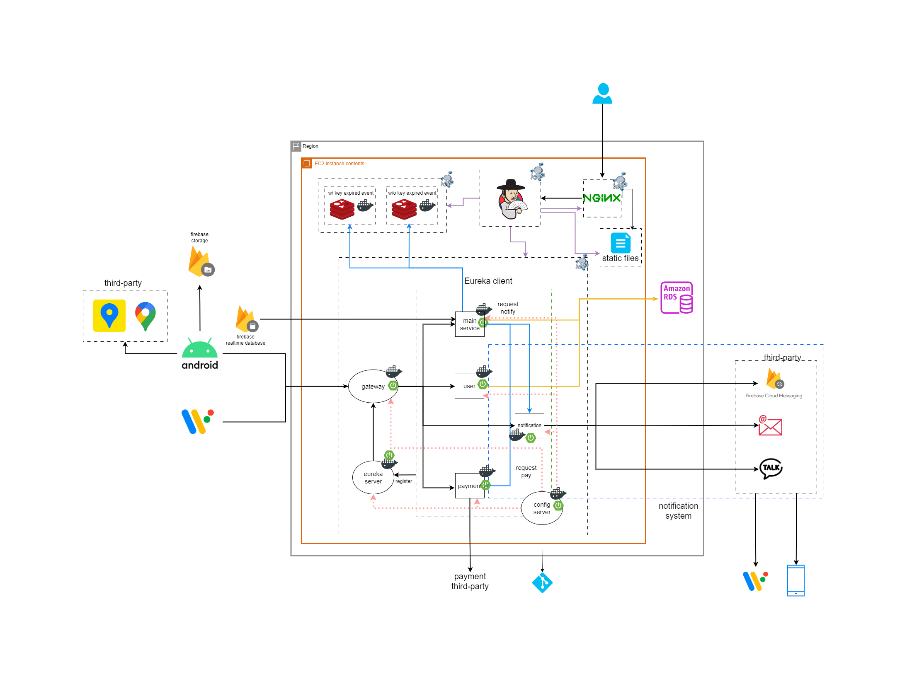
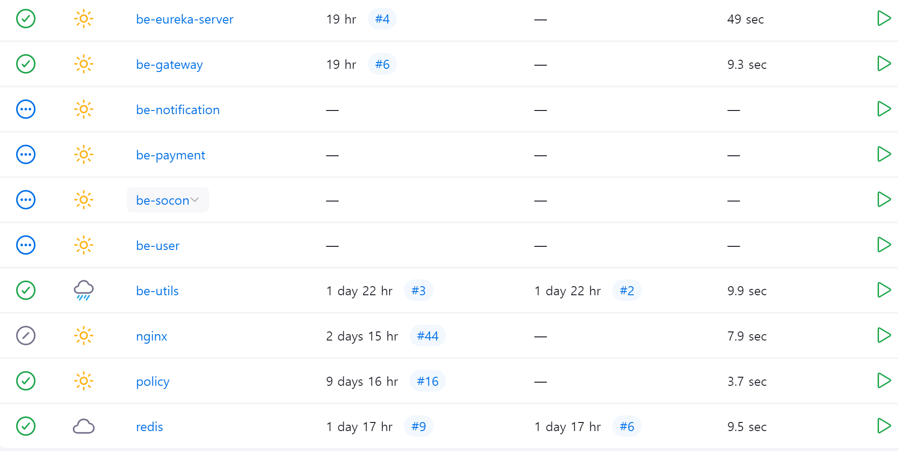

# 소콘소콘
> 지역 상생을 위한 소상공인 기프티콘 플랫폼!

## FE
### 김아현 
* 작업 내용
  * 위젯 구현
    * 반응형 설정
    * 컬러팔레트
    * 타이포그래피(폰트)
    * 탭 바
    * 장소 목록 카드
    * 검색박스
    * 토스트메세지
    * 이미지 로더
    * svg 아이콘 로더
      

*  기능
    * [반응형 설정](https://www.notion.so/kdie44/3a703cd271594436af0e19420bea16a4?pvs=4)
    * [컬러팔레트](https://www.notion.so/kdie44/209795c102e24db7a9915c7ab39e1a04?pvs=4)
    * [타이포그래피(폰트)](https://www.notion.so/kdie44/724df960598b48618e817a2fd3aaa75f?pvs=4)
    * [탭 바](https://www.notion.so/kdie44/adfb7da2fbb04a47ac41ec307571a87e?pvs=4)
    * [장소 목록 카드](https://www.notion.so/kdie44/a289f4352dc74fa48f3d3f15e157a75c?pvs=4)
    * [검색박스](https://www.notion.so/kdie44/748a8a266e9d49be9b50bdd3e6525ad2?pvs=4)
    * [토스트메세지](https://www.notion.so/kdie44/ebaf3c1cf3e0425ca246b87fb07d6236?pvs=4)
    * [이미지 로더](https://www.notion.so/kdie44/ce3acb8c49a24b08a2e0b6a46d1a113c?pvs=4)
    * [svg 아이콘 로더](https://www.notion.so/kdie44/svg-aa6aabd73d0b473cb53dc199366dd849?pvs=4)


* 학습 자료 모음
    * [Git Fetch와 Git Pull 명령어의 차이점](https://www.notion.so/kdie44/Git-Fetch-Git-Pull-20ec6a5061ba4012a7c97b145d2df335?pvs=4)
    * [keystore 생성 방법](https://www.notion.so/kdie44/keystore-dd4f4fbfa9764410bcd0c382643b461a?pvs=4)
    * [hot reload](https://www.notion.so/kdie44/Flutter-hot-reload-3f87e47709c2400c884be31062de49d6?pvs=4)
    * [Flutter에서는 어떤 디자인 패턴을 사용해야하지…?](https://www.notion.so/kdie44/Flutter-a55ab51a7e7c4f14b27fc1fabcfa5f53?pvs=4)

### 김온유
* 역할
*  기능
   * **기능명 1**
      * 기능1 상세
      * 화면
      <details>
         <summary>이번주 내용 정리</summary>
         ## 컴포넌트(위젯) 분리

- 네비게이션 바
- 이미지 카드
- 태그 아이콘/버튼
- 체크박스
- 소콘(기프티콘) 카드

> 네비게이션 바
> 

```jsx
  body: [ Tap1(), Tap2(), if (is_owner) Tap3(), Tap4(), Tap5() ][tab],

class _BottomNavBarState extends State<BottomNavBar> {
  var tab_idx = 0;
  var is_owner = true;

  @override
  Widget build(BuildContext context) {
    return BottomNavigationBar(
      type: BottomNavigationBarType.fixed,
      showSelectedLabels: false,
      showUnselectedLabels: false,
    
      onTap: (i){
        setState(() {
          tab_idx = i;
        });
        widget.onTabSelected(i);
      },
      items: [
        BottomNavigationBarItem(icon: Icon(Icons.place_outlined, color: Colors.black87, size: 30), label: '주변정보'),
        BottomNavigationBarItem(icon: Icon(Icons.sms_outlined, color: Colors.black87, size: 30), label: '소곤'),
        if(is_owner) BottomNavigationBarItem(icon: Icon(Icons.storefront, color: Colors.black87, size: 30), label: ' '),
        BottomNavigationBarItem(icon: Icon(Icons.confirmation_num_outlined, color: Colors.black87, size: 30), label: '쿠폰북'),
        BottomNavigationBarItem(icon: Icon(Icons.person_outline_rounded, color: Colors.black87, size: 30), label: '내정보'),
      ],
    );
  }
```

바텀바는 배열을 이용하여 간단하게 구현하였다.
`BottomNavBar`의 `onTabSelected` 를 이용하여 탭의 idx를 받아 해당 탭으로 이동할 수 있게 하였다.

초기에는 간단하게 페이지를 나누기 위해 이러한 방법을 이용하였지만 추후 `go_router` 을 이용하여 페이지를 이동하게 할것 같다.

> Check_Box
> 

```jsx
import 'package:flutter/material.dart';

class CheckBoxBtn extends StatefulWidget {
  final bool isChecked;
  final double size;
  CheckBoxBtn({super.key, required this.isChecked, this.size = 1, });

  @override
  State<CheckBoxBtn> createState() => _CheckBoxBtnState();
}

class _CheckBoxBtnState extends State<CheckBoxBtn> {
  late bool isChecked;

  @override
  void initState() {
    // TODO: implement initState
    super.initState();
    isChecked = widget.isChecked;
  }
  @override
  Widget build(BuildContext context) {
    return  Transform.scale(
      scale: widget.size,

      child: Row(
        // mainAxisAlignment: MainAxisAlignment.center,
        children: <Widget>[
          Checkbox(
            value: isChecked,

            // 체크박스 모양 변경
            shape: RoundedRectangleBorder(
              borderRadius: BorderRadius.circular(4),
            ),

            fillColor: MaterialStateProperty.resolveWith<Color>((states) {
              if (states.contains(MaterialState.selected)) {
                return Colors.blue; // 선택됐을 때의 내부 바탕색 설정
              }
              return Colors.white; // 기본 내부 바탕색 설정
            }),

            onChanged: (bool? value) {
              // Update Check State
              setState(() {
                isChecked = value ?? false;
              });
            },
          ),
          // 선택되었을 때 텍스트 선택
          Text(isChecked ? 'Checked' : 'Unchecked'),
        ],
      ),
    );
  }
}
```

체크박스를 만들면서 `Statless` 와 `Statefull`에 대해 더 자세하게 공부할 수 있었다.

`Statless` 는 변수를 지정해서 사용하는 것까지만 되고, 값을 변경하려면 `Statefull` 을 사용해야 했다.

또한 체크가 된경우 `isChecked` 의 여부를 부모 컴포에서도 알 수 있어야 했기 때문에 체크박스 사용 시 isChecked 를 require로 넣도록 하였다. 

> Image_Card
> 

```jsx
lass ImageCard extends StatelessWidget {
  final String imgUrl;
  final double width;
  final double height;
  final double borderRadius;

  const ImageCard({super.key, required this.imgUrl, this.width = 100, this.height = 100, this.borderRadius = 10, });

  @override
  Widget build(BuildContext context) {
    return Container(
      width: width,
      height: height,
      child: ClipRRect(
        borderRadius: BorderRadius.circular(borderRadius),
        child: Image.network(
          imgUrl,
          fit: BoxFit.fill,
        ),
      ),
    );
  }
}
```

이미지카드는 크게 두가지의 방식중 고민하였음

### 첫 번째 코드

```dart
child: Image(
  image: NetworkImage(
    '<https://cdn.pixabay.com/photo/2017/12/10/13/37/christmas-3009949_1280.jpg>',
  ),
  fit: BoxFit.cover,
)

```

이 코드는 `Image` 위젯을 사용하고, `image` 속성에 `NetworkImage` 객체를 할당한다.

`fit: BoxFit.cover`는 이미지의 비율을 유지하면서 필요한 경우 이미지의 일부를 잘라내어 부모 위젯의 전체 공간을 채운다.

### 두 번째 코드

```dart
Image.network(
  '<https://cdn.pixabay.com/photo/2017/12/10/13/37/christmas-3009949_1280.jpg>',
  width: width,
  height: height,
  fit: BoxFit.fill
)

```

이 코드는 `Image.network` 생성자를 사용하여 동일한 이미지를 로드한다. 

`fit: BoxFit.fill`은 이미지가 주어진 공간에 정확히 맞도록 조정되지만, 원본 이미지의 비율은 유지되지 않을 수 있다.

- **구현 방식**: 첫 번째 코드는 `Image` 위젯에 `NetworkImage`를 할당하는 방식이고, 두 번째 코드는 `Image.network` 생성자를 사용하는 방식이다. 두 번째 방식은 네트워크 이미지를 더 간편하게 로드할 수 있도록 설계되었다.
- **용도**: 첫 번째 방식은 더 많은 커스터마이징이 필요한 경우 유용하며, 두 번째 방식은 코드를 간결하게 유지하면서 네트워크 이미지를 빠르게 로드하고 싶을 때 적합하다.

하지만 이미지는 결국 `사용할 때`에 어떻게 어디에 담아 사용하느냐에 따라 달라지기에 일단은  편리한 두번째 방법을 사용하기로 하였지만 조금더 공부해 보는 것으로…

> Socon_Card
> 

소콘카드는 명칭은 하나이지만 조건에 따라 매우 다양한 UI로 나뉜다.

1. 내 보유 소콘
    1. 사용가능 : 상품명, 가게명, 만료일, 이미지
    2. 사용불가 : 상품명, 가게명, 이미지, 사용완료 이미지
2. 점주 소콘
    1. 등록된 상품 목록 : 상품명, 상품가격, 이미지
    2. 발행한 상품 목록 : 상품명, 상품가격, 할인여부, 할인된 금액, 전체 발행수량, 잔여수량, 메인상품여부, 태그
3. 가게 상세보기 소콘 
    1. 할인 소콘 목록 : 상품명, 상품가격, 할인여부, 할인된 금액, 전체 발행수량, 잔여수량, 메인상품여부, 태그
    2. 전체 소콘 목록(할인포함) : 할인 여부에 따라 일반가격과 할인가격 동시에 보이기
    

먼저, 점주와 사용자 측면에서 내 보유 소콘과 나머지를 다르게 만들었다.

```jsx
import 'package:flutter/cupertino.dart';
import 'package:flutter/material.dart';
import 'image_card.dart';
import 'tag_icon.dart';

class StoreSoconLists extends StatelessWidget {
  final String soconName;
  final bool isMain;
  final int maxQuantity;    // 설정된 최대 발행량
  final int issuedQuantity;   // 현재 발행 개수
  final int price;     // 상품가격(정가)
  final bool isDicounted;
  final int discountedPrice;    // 할인된 가격. 없을 경우 null
  final String imageUrl;

  const StoreSoconLists({
    super.key,
    required this.soconName,
    required this.isMain,
    required this.maxQuantity,
    required this.issuedQuantity,
    required this.price,
    required this.isDicounted,
    required this.discountedPrice,
    required this.imageUrl,
  });

  @override
  Widget build(BuildContext context) {
    final screenWidth = MediaQuery.of(context).size.width / 2;
    final remainQuantity = maxQuantity - issuedQuantity;
    final discountPercent = isDicounted ? ((price - discountedPrice) / price * 100).toStringAsFixed(0) : '0';
    return Container(
      width: screenWidth,
      margin: EdgeInsets.all(5),
      padding: EdgeInsets.only(top: 20),
      decoration: BoxDecoration(
          color: isMain ? Colors.lightGreenAccent : Colors.white,
          borderRadius: BorderRadius.circular(10),
          boxShadow: [
            BoxShadow(
              color: Colors.grey.withOpacity(0.7),
              spreadRadius: 0,
              blurRadius: 5.0,
              offset: Offset(0, 5), // changes position of shadow
            ),
          ]),
      child: Column(
        mainAxisSize: MainAxisSize.min,
        crossAxisAlignment: CrossAxisAlignment.stretch,
        children: [
          Container(
            margin: EdgeInsets.symmetric(horizontal: 15),
            child: Row(
              children: [
                TagIcon(buttonText: 'NEW', buttonColor: Color(0xffFBBC05), buttonTextColor: Colors.white),
                TagIcon(buttonText: 'SALE', buttonColor: Color(0xffFEF4444), buttonTextColor: Colors.white),
              ],
            ),
          ),
          Container(
            margin: EdgeInsets.symmetric(horizontal: 15),
            child: Row(
              mainAxisAlignment: MainAxisAlignment.spaceBetween,
              children: [
                Column(
                  crossAxisAlignment: CrossAxisAlignment.start,
                  children: [
                    Text(
                      soconName,
                      textAlign: TextAlign.start,
                      style: TextStyle(
                        fontSize: 22,
                        fontWeight: FontWeight.bold,
                        color: Colors.black, ),
                    ),
                    Container(
                      padding: EdgeInsets.only(bottom: 20),
                      child: Text(
                        '잔여수량 $remainQuantity',
                        style: TextStyle(
                            fontSize: 12,
                            color: Colors.black),
                        maxLines: 2,
                        overflow: TextOverflow.ellipsis,
                      ),
                    ),
                  ],
                ),
                Column(
                  crossAxisAlignment: CrossAxisAlignment.end,
                  children: [
                    if (isDicounted) ...[ // 할인된 경우
                      Text('($discountPercent%)', style: TextStyle(fontSize: 12, color: Colors.red), ),
                      Text('$discountedPrice원', style: TextStyle(fontSize: 20, fontWeight: FontWeight.bold, color: Colors.red)),
                      Text('$price원', style: TextStyle(fontSize: 12, decoration: TextDecoration.lineThrough, fontWeight: FontWeight.bold)),
                    ] else ...[ // 할인되지 않은 경우
                      Text('$price원', style: TextStyle(fontSize: 20, fontWeight: FontWeight.bold, color: Colors.black87)),
                    ]
                  ],
                )
              ],
            ),
          ),
          Expanded(
            child: ImageCard(
              imgUrl: imageUrl,
            ),
          ),
        ],
      ),
    );
  }
}
```

`isDicounted` 를 받아오면서 할인 여부에 따라 원가만 보이거나, 할인가와 할인퍼센트를 함께 보여줄 수 있다.

가게 상세보기 시 할인소콘만 따로 위에 보여주는데 이는 상품을 불러올 시 `filter` 를 사용하여 할인된 상품만 불러온 뒤 기프티콘 카드를 보여줄 예정이다.

> Tag_Icon
> 

```jsx
import 'package:flutter/material.dart';

// 지정값 : 세로 크기, 텍스트 크기, 텍스트 굵기
class TagIcon extends StatelessWidget {
  final String buttonText;
  final Color buttonColor;
  final Color buttonTextColor;

  const TagIcon({
    super.key,
    required this.buttonText,
    required this.buttonColor,
    required this.buttonTextColor,
  });

  @override
  Widget build(BuildContext context) {
    return Row(
      mainAxisSize: MainAxisSize.min,
      children: [
        DecoratedBox(
          decoration: BoxDecoration(
            color: buttonColor,
            borderRadius: BorderRadius.circular(50),
          ),
          child: Padding(
            padding: EdgeInsets.symmetric(horizontal: 10, vertical: 1),
            child: Text(
              buttonText,
              style: TextStyle(
                color: buttonTextColor,
                fontSize: 12,
                fontWeight: FontWeight.bold,
              ),
            ),
          ),
        ),
      ],
    );
  }
}

// 지정값 : 체크여부, 버튼 죄소 가로/세로 크기, 텍스트 크기, 텍스트 굵기
class TagButton extends StatefulWidget {
  final bool isSelected;
  final String buttonText;
  final Color buttonColor;
  final Color buttonTextColor;
  final VoidCallback onPressed;

  final double minWidth;
  final double minHeight;

  const TagButton({
    super.key,
    this.isSelected = false,
    required this.buttonText,
    required this.buttonColor,
    required this.buttonTextColor,
    required this.onPressed,
    this.minWidth = 10.0, // 최소 가로 크기
    this.minHeight = 30.0, // 최소 세로 크기
  });

  @override
  State<TagButton> createState() => _TagButtonState();
}

class _TagButtonState extends State<TagButton> {
  late bool _isSelected;

  @override
  void initState() {
    // TODO: implement initState
    super.initState();
    _isSelected = widget.isSelected;
  }

  @override
  Widget build(BuildContext context) {
    final buttonStyle = _isSelected
        ? ElevatedButton.styleFrom(
      backgroundColor: widget.buttonColor,
      minimumSize: Size(widget.minWidth, widget.minHeight),
    )
        : ElevatedButton.styleFrom(
      backgroundColor: Colors.white,
      foregroundColor: Colors.grey,
      side: BorderSide(color: Colors.grey),
      minimumSize: Size(widget.minWidth, widget.minHeight),
    );

    return TextButton(
      onPressed: () {
        setState(() {
          _isSelected = !_isSelected;
          widget.onPressed();
        });
      },
      style: buttonStyle,
      child: Text(
          widget.buttonText,
          style: TextStyle( color: _isSelected ? widget.buttonTextColor : Colors.grey, fontSize: 12, fontWeight: FontWeight.bold)),
    );
  }
}

```

태그 아이콘은 두가지 종류로 만들었다.

- 일반 태그의 경우 소콘의 new, sale 태그나 카테고리 태그 등으로 주로 사용될 예정이기 때문에 Text, 배경색, 글자색 을 입력받도록 하였다.
- 태그 버튼의 경우 점포 등록 시 태그 등을 선택할 때 주로 사용될 예정이기 때문에 클릭이벤트를 넣어주었다.

이후 일반 태그를 리팩토링하였다.

자주 쓰는 NEW, SALE 태그의 Text, 배경색, 글자색을 지정하여 편리하게 사용할 수 있도록 하고싶었다.

팩토리 패턴을 사용하여 

```jsx
 // 'NEW' 태그 아이콘을 생성하기 위한 팩토리 생성자
  factory TagIcon.NEW() {
  return TagIcon(
  buttonText: 'NEW',
  buttonColor: Color(0xffFBBC05),
  buttonTextColor: Colors.white,
  );
  }

  // 'SALE' 태그 아이콘을 생성하기 위한 팩토리 생성자
  factory TagIcon.SALE() {
    return TagIcon(
      buttonText: 'SALE',
      buttonColor: Color(0xffFEF4444),
      buttonTextColor: Colors.white,
    );
  }
```

이전엔 사용 시

```jsx
TagIcon(buttonText: 'NEW', buttonColor: Color(0xffFBBC05), buttonTextColor: Colors.white),
TagIcon(buttonText: 'SALE', buttonColor: Color(0xffFEF4444), buttonTextColor: Colors.white),
```

이렇게 각각 지정이 필요했지만 

리팩토링 후

```jsx
TagButton.NEW() 
TagButton.SALE()
```

간단하게 불러올 수 있게 되었다.
      </details>


### 탁하윤
* 역할
*  기능
   * **기능명 1**
      * 기능1 상세
      * 화면

## BE
{: height="500"}  
### 김다희
* 인프라
  * 공통 라이브러리 생성
    * [구현 과정](https://kdie44.notion.site/MSA-56cf944d100845719f3761b90376a40f?pvs=4)<br>
    
  * 시스템 구조 설계<br>
    
  * CI/CD
    * 젠킨스
        * [학습 내용](https://kdie44.notion.site/Jenkins-03219c87de904357883887944e4c0b54?pvs=4)<br>
          
* 알림
  * FCM 
    * 토픽 구독
    * 개별 알림
    * 토픽 알림
    * 전체 알림

### 김도휘
* Gateway, 회원, 결제 
*  기능
   * **Gateway**
      * Jwt 토큰 검증
      * memberId, role을 도메인에게 넘겨줌
   * **회원**
      * 로그인
      * 회원가입
      * 이메일 중복검사
      * 비밀번호 찾기
      * 마이페이지
   * **결제**
      * 기프티콘 결제
      * 소콘머니 충전
      * 소콘머니 출금
   * **정리한 내용 노션 링크**
      * https://dohwiii.notion.site/128e41ea366340578a4eeadc6304ef63?pvs=4

### 이유빈
* 점포, 소콘(기프티콘), 소곤(커뮤니티)
*  점포
   * **점포 정보 등록** : 사업자 인증이 된 유저에 한하여 본인 명의의 점포 등록 가능
   * **점포 목록 조회** : 점주 유저의 본인이 등록한 점포 목록 조회
   * **점포 정보 상세 조회**
       * 일반 유저 : 점보 일반 정보, 발행 중 소콘 정보 조회
       * 점주 유저 : 점포 일반 정보, 등록 상품 정보, 모든 발행 정보 조회
   * **점포 정보 수정** : 수정 가능 필드에 한하여 점주의 점포 정보 수정 가능
   * **폐업 신고** : 점주의 폐업 신고 시 폐업 날짜 업데이트
   * **상품 정보 등록**
   * **상품 정보 상세 조회**
   * **관심 가게 추가, 취소**
   * **관심 가게 목록 조회**
* 소콘
  * **소콘 상세 조회** : 발행된 기프티콘 정보 상세 조회 
  * **소콘북 보유 소콘 목록 조회**
  * **소콘북 내 소콘 검색**
  * **소콘 사용 승인** : 점주 유저가 본인 점포 소콘에 한하여 소콘 사용 승인 가능
  * **소콘 발행(생성)** : 주문 및 결제 완료 시 소콘 발행
  * **소콘 발행 중지** : 점주 유저의 요청 시 발행 중 소콘 발행 중지
  * **소콘 주문** : 주문 정보 생성 후 결제에 요청
* 소곤
  * **소곤 작성** : 본인 위치에 게시글 작성 기능
  * **소곤 댓글 추가** : 근처 소곤에 댓글 작성 기능
  * **소곤 댓글 채택** : 본인 작성 소곤에 작성자가 본인이 아닌 댓글 채택 기능
  * **소곤 상세 조회**
  * **작성 소곤 목록 조회** : 본인이 작성한 소곤 목록 조회
  * **작성 댓글 목록 조회** : 본인이 작성한 댓글 목록 조회
  * **반경 내 소콘 목록 조회** : 내 주변 반경 1.5km 내의 소곤 목록 조회

## 설계
  ### ERD
   
