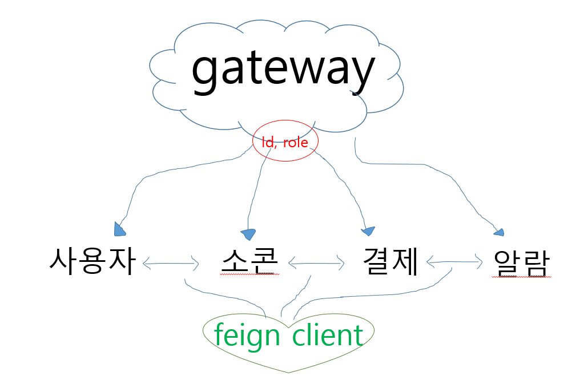
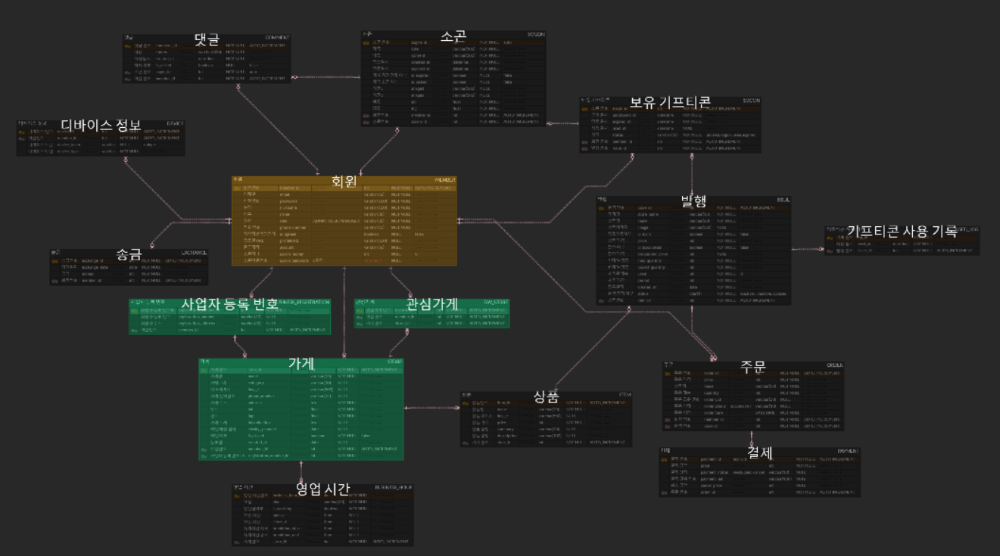

# 소콘소콘
> 지역 상생을 위한 소상공인 기프티콘 플랫폼!

## FE
### 김아현 
* 작업 내용
  * 위젯 구현
    * 반응형 설정
    * 컬러팔레트
    * 타이포그래피(폰트)
    * 탭 바
    * 장소 목록 카드
    * 검색박스
    * 토스트메세지
    * 이미지 로더
    * svg 아이콘 로더
      

*  기능
    * [반응형 설정](https://www.notion.so/kdie44/3a703cd271594436af0e19420bea16a4?pvs=4)
    * [컬러팔레트](https://www.notion.so/kdie44/209795c102e24db7a9915c7ab39e1a04?pvs=4)
    * [타이포그래피(폰트)](https://www.notion.so/kdie44/724df960598b48618e817a2fd3aaa75f?pvs=4)
    * [탭 바](https://www.notion.so/kdie44/adfb7da2fbb04a47ac41ec307571a87e?pvs=4)
    * [장소 목록 카드](https://www.notion.so/kdie44/a289f4352dc74fa48f3d3f15e157a75c?pvs=4)
    * [검색박스](https://www.notion.so/kdie44/748a8a266e9d49be9b50bdd3e6525ad2?pvs=4)
    * [토스트메세지](https://www.notion.so/kdie44/ebaf3c1cf3e0425ca246b87fb07d6236?pvs=4)
    * [이미지 로더](https://www.notion.so/kdie44/ce3acb8c49a24b08a2e0b6a46d1a113c?pvs=4)
    * [svg 아이콘 로더](https://www.notion.so/kdie44/svg-aa6aabd73d0b473cb53dc199366dd849?pvs=4)


* 학습 자료 모음
    * [Git Fetch와 Git Pull 명령어의 차이점](https://www.notion.so/kdie44/Git-Fetch-Git-Pull-20ec6a5061ba4012a7c97b145d2df335?pvs=4)
    * [keystore 생성 방법](https://www.notion.so/kdie44/keystore-dd4f4fbfa9764410bcd0c382643b461a?pvs=4)
    * [hot reload](https://www.notion.so/kdie44/Flutter-hot-reload-3f87e47709c2400c884be31062de49d6?pvs=4)
    * [Flutter에서는 어떤 디자인 패턴을 사용해야하지…?](https://www.notion.so/kdie44/Flutter-a55ab51a7e7c4f14b27fc1fabcfa5f53?pvs=4)

### 김온유
<details>
<summary>이번주 내용 정리</summary>
<div markdown='1'>
  
  ## 컴포넌트(위젯) 분리

  - 네비게이션 바
  - 이미지 카드
  - 태그 아이콘/버튼
  - 체크박스
  - 소콘(기프티콘) 카드

  > 네비게이션 바
  > 

  ```jsx
    body: [ Tap1(), Tap2(), if (is_owner) Tap3(), Tap4(), Tap5() ][tab],

  class _BottomNavBarState extends State<BottomNavBar> {
    var tab_idx = 0;
    var is_owner = true;

    @override
    Widget build(BuildContext context) {
      return BottomNavigationBar(
        type: BottomNavigationBarType.fixed,
        showSelectedLabels: false,
        showUnselectedLabels: false,
      
        onTap: (i){
          setState(() {
            tab_idx = i;
          });
          widget.onTabSelected(i);
        },
        items: [
          BottomNavigationBarItem(icon: Icon(Icons.place_outlined, color: Colors.black87, size: 30), label: '주변정보'),
          BottomNavigationBarItem(icon: Icon(Icons.sms_outlined, color: Colors.black87, size: 30), label: '소곤'),
          if(is_owner) BottomNavigationBarItem(icon: Icon(Icons.storefront, color: Colors.black87, size: 30), label: ' '),
          BottomNavigationBarItem(icon: Icon(Icons.confirmation_num_outlined, color: Colors.black87, size: 30), label: '쿠폰북'),
          BottomNavigationBarItem(icon: Icon(Icons.person_outline_rounded, color: Colors.black87, size: 30), label: '내정보'),
        ],
      );
    }
  ```

  바텀바는 배열을 이용하여 간단하게 구현하였다.
  `BottomNavBar`의 `onTabSelected` 를 이용하여 탭의 idx를 받아 해당 탭으로 이동할 수 있게 하였다.

  초기에는 간단하게 페이지를 나누기 위해 이러한 방법을 이용하였지만 추후 `go_router` 을 이용하여 페이지를 이동하게 할것 같다.

  > Check_Box
  > 

  ```jsx
  import 'package:flutter/material.dart';

  class CheckBoxBtn extends StatefulWidget {
    final bool isChecked;
    final double size;
    CheckBoxBtn({super.key, required this.isChecked, this.size = 1, });

    @override
    State<CheckBoxBtn> createState() => _CheckBoxBtnState();
  }

  class _CheckBoxBtnState extends State<CheckBoxBtn> {
    late bool isChecked;

    @override
    void initState() {
      // TODO: implement initState
      super.initState();
      isChecked = widget.isChecked;
    }
    @override
    Widget build(BuildContext context) {
      return  Transform.scale(
        scale: widget.size,

        child: Row(
          // mainAxisAlignment: MainAxisAlignment.center,
          children: <Widget>[
            Checkbox(
              value: isChecked,

              // 체크박스 모양 변경
              shape: RoundedRectangleBorder(
                borderRadius: BorderRadius.circular(4),
              ),

              fillColor: MaterialStateProperty.resolveWith<Color>((states) {
                if (states.contains(MaterialState.selected)) {
                  return Colors.blue; // 선택됐을 때의 내부 바탕색 설정
                }
                return Colors.white; // 기본 내부 바탕색 설정
              }),

              onChanged: (bool? value) {
                // Update Check State
                setState(() {
                  isChecked = value ?? false;
                });
              },
            ),
            // 선택되었을 때 텍스트 선택
            Text(isChecked ? 'Checked' : 'Unchecked'),
          ],
        ),
      );
    }
  }
  ```

  체크박스를 만들면서 `Statless` 와 `Statefull`에 대해 더 자세하게 공부할 수 있었다.

  `Statless` 는 변수를 지정해서 사용하는 것까지만 되고, 값을 변경하려면 `Statefull` 을 사용해야 했다.

  또한 체크가 된경우 `isChecked` 의 여부를 부모 컴포에서도 알 수 있어야 했기 때문에 체크박스 사용 시 isChecked 를 require로 넣도록 하였다. 

  > Image_Card
  > 

  ```jsx
  lass ImageCard extends StatelessWidget {
    final String imgUrl;
    final double width;
    final double height;
    final double borderRadius;

    const ImageCard({super.key, required this.imgUrl, this.width = 100, this.height = 100, this.borderRadius = 10, });

    @override
    Widget build(BuildContext context) {
      return Container(
        width: width,
        height: height,
        child: ClipRRect(
          borderRadius: BorderRadius.circular(borderRadius),
          child: Image.network(
            imgUrl,
            fit: BoxFit.fill,
          ),
        ),
      );
    }
  }
  ```

  이미지카드는 크게 두가지의 방식중 고민하였음

  ### 첫 번째 코드

  ```dart
  child: Image(
    image: NetworkImage(
      '<https://cdn.pixabay.com/photo/2017/12/10/13/37/christmas-3009949_1280.jpg>',
    ),
    fit: BoxFit.cover,
  )

  ```

  이 코드는 `Image` 위젯을 사용하고, `image` 속성에 `NetworkImage` 객체를 할당한다.

  `fit: BoxFit.cover`는 이미지의 비율을 유지하면서 필요한 경우 이미지의 일부를 잘라내어 부모 위젯의 전체 공간을 채운다.

  ### 두 번째 코드

  ```dart
  Image.network(
    '<https://cdn.pixabay.com/photo/2017/12/10/13/37/christmas-3009949_1280.jpg>',
    width: width,
    height: height,
    fit: BoxFit.fill
  )

  ```

  이 코드는 `Image.network` 생성자를 사용하여 동일한 이미지를 로드한다. 

  `fit: BoxFit.fill`은 이미지가 주어진 공간에 정확히 맞도록 조정되지만, 원본 이미지의 비율은 유지되지 않을 수 있다.

  - **구현 방식**: 첫 번째 코드는 `Image` 위젯에 `NetworkImage`를 할당하는 방식이고, 두 번째 코드는 `Image.network` 생성자를 사용하는 방식이다. 두 번째 방식은 네트워크 이미지를 더 간편하게 로드할 수 있도록 설계되었다.
  - **용도**: 첫 번째 방식은 더 많은 커스터마이징이 필요한 경우 유용하며, 두 번째 방식은 코드를 간결하게 유지하면서 네트워크 이미지를 빠르게 로드하고 싶을 때 적합하다.

  하지만 이미지는 결국 `사용할 때`에 어떻게 어디에 담아 사용하느냐에 따라 달라지기에 일단은  편리한 두번째 방법을 사용하기로 하였지만 조금더 공부해 보는 것으로…

  > Socon_Card
  > 

  소콘카드는 명칭은 하나이지만 조건에 따라 매우 다양한 UI로 나뉜다.

  1. 내 보유 소콘
      1. 사용가능 : 상품명, 가게명, 만료일, 이미지
      2. 사용불가 : 상품명, 가게명, 이미지, 사용완료 이미지
  2. 점주 소콘
      1. 등록된 상품 목록 : 상품명, 상품가격, 이미지
      2. 발행한 상품 목록 : 상품명, 상품가격, 할인여부, 할인된 금액, 전체 발행수량, 잔여수량, 메인상품여부, 태그
  3. 가게 상세보기 소콘 
      1. 할인 소콘 목록 : 상품명, 상품가격, 할인여부, 할인된 금액, 전체 발행수량, 잔여수량, 메인상품여부, 태그
      2. 전체 소콘 목록(할인포함) : 할인 여부에 따라 일반가격과 할인가격 동시에 보이기
      

  먼저, 점주와 사용자 측면에서 내 보유 소콘과 나머지를 다르게 만들었다.

  ```jsx
  import 'package:flutter/cupertino.dart';
  import 'package:flutter/material.dart';
  import 'image_card.dart';
  import 'tag_icon.dart';

  class StoreSoconLists extends StatelessWidget {
    final String soconName;
    final bool isMain;
    final int maxQuantity;    // 설정된 최대 발행량
    final int issuedQuantity;   // 현재 발행 개수
    final int price;     // 상품가격(정가)
    final bool isDicounted;
    final int discountedPrice;    // 할인된 가격. 없을 경우 null
    final String imageUrl;

    const StoreSoconLists({
      super.key,
      required this.soconName,
      required this.isMain,
      required this.maxQuantity,
      required this.issuedQuantity,
      required this.price,
      required this.isDicounted,
      required this.discountedPrice,
      required this.imageUrl,
    });

    @override
    Widget build(BuildContext context) {
      final screenWidth = MediaQuery.of(context).size.width / 2;
      final remainQuantity = maxQuantity - issuedQuantity;
      final discountPercent = isDicounted ? ((price - discountedPrice) / price * 100).toStringAsFixed(0) : '0';
      return Container(
        width: screenWidth,
        margin: EdgeInsets.all(5),
        padding: EdgeInsets.only(top: 20),
        decoration: BoxDecoration(
            color: isMain ? Colors.lightGreenAccent : Colors.white,
            borderRadius: BorderRadius.circular(10),
            boxShadow: [
              BoxShadow(
                color: Colors.grey.withOpacity(0.7),
                spreadRadius: 0,
                blurRadius: 5.0,
                offset: Offset(0, 5), // changes position of shadow
              ),
            ]),
        child: Column(
          mainAxisSize: MainAxisSize.min,
          crossAxisAlignment: CrossAxisAlignment.stretch,
          children: [
            Container(
              margin: EdgeInsets.symmetric(horizontal: 15),
              child: Row(
                children: [
                  TagIcon(buttonText: 'NEW', buttonColor: Color(0xffFBBC05), buttonTextColor: Colors.white),
                  TagIcon(buttonText: 'SALE', buttonColor: Color(0xffFEF4444), buttonTextColor: Colors.white),
                ],
              ),
            ),
            Container(
              margin: EdgeInsets.symmetric(horizontal: 15),
              child: Row(
                mainAxisAlignment: MainAxisAlignment.spaceBetween,
                children: [
                  Column(
                    crossAxisAlignment: CrossAxisAlignment.start,
                    children: [
                      Text(
                        soconName,
                        textAlign: TextAlign.start,
                        style: TextStyle(
                          fontSize: 22,
                          fontWeight: FontWeight.bold,
                          color: Colors.black, ),
                      ),
                      Container(
                        padding: EdgeInsets.only(bottom: 20),
                        child: Text(
                          '잔여수량 $remainQuantity',
                          style: TextStyle(
                              fontSize: 12,
                              color: Colors.black),
                          maxLines: 2,
                          overflow: TextOverflow.ellipsis,
                        ),
                      ),
                    ],
                  ),
                  Column(
                    crossAxisAlignment: CrossAxisAlignment.end,
                    children: [
                      if (isDicounted) ...[ // 할인된 경우
                        Text('($discountPercent%)', style: TextStyle(fontSize: 12, color: Colors.red), ),
                        Text('$discountedPrice원', style: TextStyle(fontSize: 20, fontWeight: FontWeight.bold, color: Colors.red)),
                        Text('$price원', style: TextStyle(fontSize: 12, decoration: TextDecoration.lineThrough, fontWeight: FontWeight.bold)),
                      ] else ...[ // 할인되지 않은 경우
                        Text('$price원', style: TextStyle(fontSize: 20, fontWeight: FontWeight.bold, color: Colors.black87)),
                      ]
                    ],
                  )
                ],
              ),
            ),
            Expanded(
              child: ImageCard(
                imgUrl: imageUrl,
              ),
            ),
          ],
        ),
      );
    }
  }
  ```

  `isDicounted` 를 받아오면서 할인 여부에 따라 원가만 보이거나, 할인가와 할인퍼센트를 함께 보여줄 수 있다.

  가게 상세보기 시 할인소콘만 따로 위에 보여주는데 이는 상품을 불러올 시 `filter` 를 사용하여 할인된 상품만 불러온 뒤 기프티콘 카드를 보여줄 예정이다.

  > Tag_Icon
  > 

  ```jsx
  import 'package:flutter/material.dart';

  // 지정값 : 세로 크기, 텍스트 크기, 텍스트 굵기
  class TagIcon extends StatelessWidget {
    final String buttonText;
    final Color buttonColor;
    final Color buttonTextColor;

    const TagIcon({
      super.key,
      required this.buttonText,
      required this.buttonColor,
      required this.buttonTextColor,
    });

    @override
    Widget build(BuildContext context) {
      return Row(
        mainAxisSize: MainAxisSize.min,
        children: [
          DecoratedBox(
            decoration: BoxDecoration(
              color: buttonColor,
              borderRadius: BorderRadius.circular(50),
            ),
            child: Padding(
              padding: EdgeInsets.symmetric(horizontal: 10, vertical: 1),
              child: Text(
                buttonText,
                style: TextStyle(
                  color: buttonTextColor,
                  fontSize: 12,
                  fontWeight: FontWeight.bold,
                ),
              ),
            ),
          ),
        ],
      );
    }
  }

  // 지정값 : 체크여부, 버튼 죄소 가로/세로 크기, 텍스트 크기, 텍스트 굵기
  class TagButton extends StatefulWidget {
    final bool isSelected;
    final String buttonText;
    final Color buttonColor;
    final Color buttonTextColor;
    final VoidCallback onPressed;

    final double minWidth;
    final double minHeight;

    const TagButton({
      super.key,
      this.isSelected = false,
      required this.buttonText,
      required this.buttonColor,
      required this.buttonTextColor,
      required this.onPressed,
      this.minWidth = 10.0, // 최소 가로 크기
      this.minHeight = 30.0, // 최소 세로 크기
    });

    @override
    State<TagButton> createState() => _TagButtonState();
  }

  class _TagButtonState extends State<TagButton> {
    late bool _isSelected;

    @override
    void initState() {
      // TODO: implement initState
      super.initState();
      _isSelected = widget.isSelected;
    }

    @override
    Widget build(BuildContext context) {
      final buttonStyle = _isSelected
          ? ElevatedButton.styleFrom(
        backgroundColor: widget.buttonColor,
        minimumSize: Size(widget.minWidth, widget.minHeight),
      )
          : ElevatedButton.styleFrom(
        backgroundColor: Colors.white,
        foregroundColor: Colors.grey,
        side: BorderSide(color: Colors.grey),
        minimumSize: Size(widget.minWidth, widget.minHeight),
      );

      return TextButton(
        onPressed: () {
          setState(() {
            _isSelected = !_isSelected;
            widget.onPressed();
          });
        },
        style: buttonStyle,
        child: Text(
            widget.buttonText,
            style: TextStyle( color: _isSelected ? widget.buttonTextColor : Colors.grey, fontSize: 12, fontWeight: FontWeight.bold)),
      );
    }
  }

  ```

  태그 아이콘은 두가지 종류로 만들었다.

  - 일반 태그의 경우 소콘의 new, sale 태그나 카테고리 태그 등으로 주로 사용될 예정이기 때문에 Text, 배경색, 글자색 을 입력받도록 하였다.
  - 태그 버튼의 경우 점포 등록 시 태그 등을 선택할 때 주로 사용될 예정이기 때문에 클릭이벤트를 넣어주었다.

  이후 일반 태그를 리팩토링하였다.

  자주 쓰는 NEW, SALE 태그의 Text, 배경색, 글자색을 지정하여 편리하게 사용할 수 있도록 하고싶었다.

  팩토리 패턴을 사용하여 

  ```jsx
  // 'NEW' 태그 아이콘을 생성하기 위한 팩토리 생성자
    factory TagIcon.NEW() {
    return TagIcon(
    buttonText: 'NEW',
    buttonColor: Color(0xffFBBC05),
    buttonTextColor: Colors.white,
    );
    }

    // 'SALE' 태그 아이콘을 생성하기 위한 팩토리 생성자
    factory TagIcon.SALE() {
      return TagIcon(
        buttonText: 'SALE',
        buttonColor: Color(0xffFEF4444),
        buttonTextColor: Colors.white,
      );
    }
  ```

  이전엔 사용 시

  ```jsx
  TagIcon(buttonText: 'NEW', buttonColor: Color(0xffFBBC05), buttonTextColor: Colors.white),
  TagIcon(buttonText: 'SALE', buttonColor: Color(0xffFEF4444), buttonTextColor: Colors.white),
  ```

  이렇게 각각 지정이 필요했지만 

  리팩토링 후

  ```jsx
  TagButton.NEW() 
  TagButton.SALE()
  ```

  간단하게 불러올 수 있게 되었다.
</div>
</details>


### 탁하윤
- 작업 내용

  - 위젯 구현
    - 아이콘 팔레트
    - 버튼 재사용 클래스
    - 입력 재사용 클래스
  - Flutter 학습

- 기능 구현

  - [버튼 컴포넌트 명세서](https://kdie44.notion.site/cfd3e8ee1ba64ff0a6f3c174e68fde67)
    - [GITLAB - feat/S10P22C207-174-buttons](https://lab.ssafy.com/s10-blockchain-contract-sub2/S10P22C207/-/blob/feat/S10P22C207-174-buttons/frontend/lib/view/atoms/buttons.dart)
  - [아이콘 컴포넌트 명세서](https://kdie44.notion.site/5576a2cfd3d045c4b9fa7820df62d26a)
    - [GITLAB - feat/S10P22C207-281-icons](https://lab.ssafy.com/s10-blockchain-contract-sub2/S10P22C207/-/blob/feat/S10P22C207-281-icons/frontend/lib/utils/icons.dart?ref_type=heads)
  - [입력 컴포넌트 명세서](https://kdie44.notion.site/8609e08f337c4fe79d867a52efc598dc)
    - [GITLAB - feat/S10P22C207-203-inputs](https://lab.ssafy.com/s10-blockchain-contract-sub2/S10P22C207/-/blob/feat/S10P22C207-203-inputs/frontend/lib/view/atoms/inputs.dart?ref_type=heads)

- 학습 내용
<details>
<summary>Flutter Hot Reload가 안되는 이유</summary>
<div markdown="1">

### 참고 URL

https://yjkim-dev.tistory.com/81

https://hoony-gunputer.tistory.com/entry/Hot-reload-Hot-Restart

### 발생 개요

Flutter는 저장하면 핫리로드가 가능하다고 하는데 적용되지 않는 문제가 발생했다.

### 해결 방법

**핫 리로드는 Flutter 앱의 모든 코드, 링킹 등을 해서 실행하는 것이 아니라 Statless에 위치한 build 함수만을 업데이트해준다.**

따라서 Stateless, Stateful한 위젯이 아니기 때문에 핫리로드가 적용되지 않았다.

StatelessWidget으로 변경 후 정상 작동한다.

### 오류 발생 코드

```dart
// main.dart
import 'package:flutter/material.dart';

void main() {
  runApp(
    const MaterialApp(
      debugShowCheckedModeBanner: false,
      home: Scaffold(
        body: SizedBox(
          width: double.infinity,
        child: Column(
          mainAxisAlignment: MainAxisAlignment.center,
          children: [
            Text('Hello'),
            Text('Hi'),
          ],
        ),
      ),
    ),
  ),
  );
}
```

### 해결 코드

```dart
// main.dart
import 'package:flutter/material.dart';

void main() {
  runApp(
    MyApp()
  );
}

class MyApp extends StatelessWidget {
  @override
  Widget build(BuildContext context) {
    return const MaterialApp(
      debugShowCheckedModeBanner: false,
      home: Scaffold(
        body: SizedBox(
          width: double.infinity,
          child: Column(
            mainAxisAlignment: MainAxisAlignment.center,
            children: [
              Text('Hello'),
              Text('Hi'),
            ],
          ),
        ),
      ),
    );
  }
}
```

</div>

</details>

<details>
<summary>flutter 프로젝트 구조</summary>
<div markdown="1">


.idea: 개발 도구 관련 설정 파일이 위치한 폴더

Android: 플러터를 컴파일하여 생성된 안드로이드 네이티브 코드들이 생성됨

build: 빌드 시 생성됩니다. 플러터 프로젝트 생성시에는 생성되어 있지 않음

ios: 플러터를 컴파일하여 생성된 iOS 네이티브 코드들이 생성됨

lib: 플러터 앱 개발을 위하여 다트 소스 코드가 위치한 폴더, 최초 생성시 main.dart 파일 생성

linux: 플러터를 컴파일하여 생성된 리눅스 프로젝트 관련 파일과 코드들이 생성됨(플러터 3.0 부터 지원)

macos: 플러터를 컴파일하여 생성된 맥OS 프로젝트 관련 파일과 코드들이 생성됨(플러터 3.0 부터 지원)

.gitignore: git 설정 파일, 로컬에서만 필요한 파일이 Git에 올라가지 않도록 제외되는 부분을 사용자가 설정

.metadata: 프로젝트가 관리하는 파일로 플러터 프로젝트 속성 및 플러터 버전을 관리, 임의로 수정하지 않음

analysis_options.yaml: 플러터 앱, 다트 코드에 대한 lint 규칙을 작성해서 사용하는 파일

hello_flutter.iml: 개발 도구에 필요한 설정 파일, 임의로 수정하지 않음

pubsec.lock: 패키지에 대한 버전과 의존성 경로가 관리되는 파일, 패키지 매니저가 이용. 임의로 수정하지 않음

pubspec.yaml: 플러터 프로젝트에서 중요한 파일, 사람에게 읽기 쉽게 만들어진 마크업 언어 파일로 플러터 프로젝트에 필요한 앱 이름, 버전, 빌드, 의존성, 리소스, 패키지, 라이브러리 등을 지정하는 파일.

README.md: 프로젝트 설명을 작성하는 파일로 사용자가 작성

.package: pubspec.yaml과 관련되니 내부 파일을 자동 생성, pubspec.yaml에 추가한 패키지들을 여기에 생성

</div>
</details>

<details>
<summary>flutter TextFormField 속성 정리</summary>
<div markdown="1">
  
### `TextFormField`의 `validator` 로 유효성 검사를 쉽게 할 수 있다.

- `TextField` 위젯을 기반으로 하며, Form과 함께 사용될 때 유효성 검사(logic)를 포함할 수 있는 위젯

참고: https://blog.codefactory.ai/flutter/form/

**속성**

- `autovalidateMode`: 사용자 입력의 유효성 검사를 어떻게 할 것인지 결정하는 속성
- `autocorrect`: 텍스트를 자동으로 수정할지 여부 결정
- `autoFocus`: 위젯이 화면에 나타날 때 자동으로 포커스를 받을지 여부 결정
- `buildCounter`: 남은 글자 수를 사용자 정의 방식으로 표시할 수 있는 콜백 함수
- `controller`: 텍스트를 제어하는 데 사용되는 `TextEditingController`
  - 초기 텍스트 설정
  - 사용자 입력값 가져오기
  - 텍스트 필드의 현재 값 변경 가능
- `cursorColor`: 커서의 색상 지정
- `cursorHeight`: 커서의 높이 지정
- `cursorRadius`: 커서의 모서리를 얼마나 둥글게 할지 결정
- `cursorWidth`: 커서의 너비를 지정
- `decoration`: 텍스트 필드의 외형을 디자인하는데 사용되는 `InputDecoration` 객체
- `enabled`: 필드가 활성화되어 있는지 여부 결정
- `enableInteractiveSelection`: 사용자가 텍스트를 선택할 수 있게 할지 결정
- `enableSuggestions`: 입력 추천을 활성화할지 결정
- `expands`: 텍스트 필드가 차지할 수 있는 공간을 최대한으로 확장할지 결정
- `focusNode`: 텍스트 필드의 포커스를 관리하는데 사용
- `initialValue`: 텍스트 필드의 초기값 설정
- `inputFormatters`: 사용자 입력을 특정 형식으로 제한하는 `TextInputFormatter`의 리스트
- `keyboardAppearance`: 키보드의 밝기 모드(어두운 모드 혹은 밝은 모드) 지정
- `keyboardType`: 사용할 키보드 타입 지정
- `maxLength`: 입력할 수 있는 최대 문자 수 지정
- `maxLengthEnforcement`: 최대 길이를 초과하는 입력을 어떻게 처리할지 결정
- `maxLines`: 최대 줄 수 지정
- `minLines`: 최소 줄 수 지정
- `obscureText`: 민감한 정보를 입력받을 때 내용을 숨길지 결정
- `onChanged`: 텍스트가 변경될 때 호출되는 콜백 함수
- `onEditingComplete`: 편집이 완료될 때 호출되는 콜백 함수
- `onFieldSubmitted`: 필드에서 제출이 발생할 때 호출되는 콜백 함수
- `onSaved`: Form이 저장될 때 호출되는 콜백 함수
  - 입력된 값을 모델에 저장 또는 처리 가능
- `onTap`: 텍스트 필드를 탭할 때 호출되는 콜백 함수
- `readOnly`: 필드가 읽기 전용인지 여부를 결정
- `scrollPadding`: 텍스트 필드가 포커스를 받았을 때 화면에서 얼마나 스크롤 될지 결정
- `scrollPhysics`: 스크롤 동작을 어떻게 처리할지 결정
- `showCursor`: 커서 표시 여부 결정
- `style`: 텍스트 필드 내의 텍스트 스타일 정의
- `textAlign`: 텍스트 필드 내의 텍스트 정렬 결정
- `textAlignVertical`: 텍스트 필드 내의 텍스트 수직 정렬 결정
- `textCapitalization`: 텍스트 입력 시 대문자 변환 방식 결정
- `textDirection`: 텍스트의 방향성 결정
- `textInputAction`: 키보드에서 "다음", "완료" 등의 특수 키의 모양 결정
- `validator`: 사용자 입력의 유효성 검사 함수
  - 입력 값이 유효하지 않은 경우 오류 메시지 반환
- `value`: 폼 필드의 현재 값

### `InputDecoration` 클래스 속성

`InputDecoration` 클래스는 플러터(Flutter)의 텍스트 입력 필드를 꾸미는 데 사용되는 다양한 속성을 제공한다.

- `icon`: 입력 필드 앞에 표시되는 아이콘
- `labelText`: 입력 필드 위에 표시되는 텍스트 라벨
  - 사용자가 필드에 포커스를 맞추거나 입력을 시작할 때, 라벨은 작아지고 입력 필드 위로 올라간다.
- `labelStyle`: `labelText` 스타일 정의
  - 텍스트의 색상, 글꼴 크기 등을 설정할 수 있습니다.
- `helperText`: 입력 필드 아래에 표시되는 추가적인 텍스트
  - 사용자에게 입력 필드의 사용 방법을 설명하는 데 도움을 준다.
- `helperStyle`: `helperText` 스타일 정의
- `hintText`: 입력 필드에 아무것도 입력되지 않았을 때 표시되는 텍스트
  - 사용자에게 어떤 정보를 입력해야 하는지 알려준다.
- `hintStyle`: `hintText` 스타일을 정의
- `errorText`: 입력이 유효하지 않을 때 입력 필드 아래에 표시되는 오류 메시지
- `errorStyle`: `errorText` 스타일을 정의
- `prefixIcon`: 입력 필드 내부의 시작 부분에 표시되는 아이콘
- `suffixIcon`: 입력 필드 내부의 끝 부분에 표시되는 아이콘
- `border`: 입력 필드 외곽선을 정의
  - `InputBorder` 클래스 사용
  - `OutlineInputBorder`
  - `UnderlineInputBorder`
- `filled`: 입력 필드의 배경을 채울지 여부를 결정하는 부울 값
- `fillColor`: `filled`가 `true`일 때 입력 필드 배경색 정의
- `alignLabelWithHint`: 멀티라인 `TextField`와 `TextFormField`의 경우, 라벨이 힌트 텍스트와 정렬되도록 한다. (기본값은 `false` )
- `contentPadding`: 필드 내부에서 컨텐츠가 차지하는 공간의 패딩
- `counter`: 입력 필드의 하단에 표시되는 위젯, 일반적으로 입력된 문자 수를 나타낸다.
- `counterStyle`: `counter` 텍스트의 스타일 정의
- `counterText`: `counter` 위젯의 기본값 대신 사용될 텍스트
- `disabledBorder`: 필드가 비활성화(disabled) 상태일 때 사용되는 외곽선 스타일
- `enabled`: 필드가 활성화 상태인지 여부 결정
- `enabledBorder`: 필드가 활성화(enabled) 상태이지만 포커스를 받지 않았을 때 사용되는 외곽선 스타일
- `errorBorder`: 필드에 오류가 있을 때 사용되는 외곽선 스타일
- `errorMaxLines`: 오류 텍스트가 차지할 수 있는 최대 줄 수
- `floatingLabelBehavior`: 라벨이 어떻게 표시될지를 결정하는 속성
  - `FloatingLabelBehavior.always` : 항상 떠 있는 라벨 표시
  - `FloatingLabelBehavior.never`: 라벨을 표시 X
  - `FloatingLabelBehavior.auto`: 사용자가 입력을 시작할 때 라벨이 떠오른다.
- `focusColor`: 필드가 포커스를 받았을 때의 배경 색상
- `hoverColor`: 마우스 커서가 위에 올라갔을 때의 배경 색상
- `isCollapsed`: 텍스트 필드 내부의 모든 공간(아이콘, 라벨, 카운터 등)을 최소화할지 여부를 결정
- `isDense`: 필드의 높이를 줄여서 더 조밀하게 표시할지 여부 결정
- `prefix`: 입력 필드의 시작 부분에 표시되는 위젯
  - `prefixIcon`과 달리 텍스트 필드 내부에 더 밀접하게 표시
- `prefixText`: `prefix` 위젯 대신 사용될 수 있는 텍스트
  - 필드의 시작 부분에 표시
- `prefixStyle`: `prefixText`의 스타일 정의
- `suffix`: 입력 필드의 끝 부분에 표시되는 위젯
</div>
</details>

<details>
<summary>버튼 컴포넌트를 어떻게 만들어야 할까?</summary>
<div markdown="1">

### 고민 사항

1. 버튼 사이즈별 대응을 어떻게 할 것인가?

- 클래스를 각각 만든다
  - 로직이 같은데 굳이 클래스로 따로 빼는건 비효율적
- Factory 디자인패턴으로 만든다
  - 클래스보다 유지보수하기 쉽지만 요구하는 속성이 같기 때문에 쓰지 않는다.
- if문으로 조건을 분기한다
  - 제일 간단하게 처리 가능하기 때문에 사이즈를 미리 배열로 만들어두고 state로 사이즈를 처리한다.

1. 버튼 상태 관리를 어떻게 할 것인가?

- true/false값 구분으로 disabled처리를 하나? 조건식은 안넣어도 되는것인가
  -> flutter의 `ElevatedButton` 은 onPressed에 null값을 보내주면 disabled처리됨

### 해결법

1. 버튼 사이즈별 대응을 어떻게 할 것인가?
   1. 사이즈를 string으로 입력받고 size 맵을 만들어 각각 분기하여 결정
2. 버튼 상태 관리를 어떻게 할 것인가? 1. onPressed 함수를 required에서 null도 받을 수 있게하여 disabled 처리가능하게 함
</div>
</details>
<details>
<summary>flutter 디자인패턴, 설계 참고 링크</summary>
<div markdown="1">

- [협업과 유지보수, 두 마리 토끼를 잡는 Flutter UI 클린 코드](https://velog.io/@ximya_hf/how-write-clean-flutter-ui-code)

- [[Flutter] TDD로 가는 길 - 2부 TDD 가능한 구조로 설계하기](https://ctoahn.tistory.com/37)

- MVVM: [https://hanab.kr/flutter-mvvm-패턴-코드-구조-최적화하기/](https://hanab.kr/flutter-mvvm-%ED%8C%A8%ED%84%B4-%EC%BD%94%EB%93%9C-%EA%B5%AC%EC%A1%B0-%EC%B5%9C%EC%A0%81%ED%99%94%ED%95%98%EA%B8%B0/)
</div>
</details>

## BE
{: height="500"}  
### 김다희
* 인프라
  * 공통 라이브러리 생성
    * [구현 과정](https://kdie44.notion.site/MSA-56cf944d100845719f3761b90376a40f?pvs=4)<br>
    
  * 시스템 구조 설계<br>
    
  * CI/CD
    * 젠킨스
        * [학습 내용](https://kdie44.notion.site/Jenkins-03219c87de904357883887944e4c0b54?pvs=4)<br>
          
* 알림
  * FCM 
    * 토픽 구독
    * 개별 알림
    * 토픽 알림
    * 전체 알림

### 김도휘
* Gateway, 회원, 결제 
*  기능
   * **Gateway**
      * Jwt 토큰 검증
      * memberId, role을 도메인에게 넘겨줌
   * **회원**
      * 로그인
      * 회원가입
      * 이메일 중복검사
      * 비밀번호 찾기
      * 마이페이지
   * **결제**
      * 기프티콘 결제
      * 소콘머니 충전
      * 소콘머니 출금
   * **정리한 내용 노션 링크**
      * https://dohwiii.notion.site/128e41ea366340578a4eeadc6304ef63?pvs=4

### 이유빈
* 점포, 소콘(기프티콘), 소곤(커뮤니티)
*  점포
   * **점포 정보 등록** : 사업자 인증이 된 유저에 한하여 본인 명의의 점포 등록 가능
   * **점포 목록 조회** : 점주 유저의 본인이 등록한 점포 목록 조회
   * **점포 정보 상세 조회**
       * 일반 유저 : 점보 일반 정보, 발행 중 소콘 정보 조회
       * 점주 유저 : 점포 일반 정보, 등록 상품 정보, 모든 발행 정보 조회
   * **점포 정보 수정** : 수정 가능 필드에 한하여 점주의 점포 정보 수정 가능
   * **폐업 신고** : 점주의 폐업 신고 시 폐업 날짜 업데이트
   * **상품 정보 등록**
   * **상품 정보 상세 조회**
   * **관심 가게 추가, 취소**
   * **관심 가게 목록 조회**
* 소콘
  * **소콘 상세 조회** : 발행된 기프티콘 정보 상세 조회 
  * **소콘북 보유 소콘 목록 조회**
  * **소콘북 내 소콘 검색**
  * **소콘 사용 승인** : 점주 유저가 본인 점포 소콘에 한하여 소콘 사용 승인 가능
  * **소콘 발행(생성)** : 주문 및 결제 완료 시 소콘 발행
  * **소콘 발행 중지** : 점주 유저의 요청 시 발행 중 소콘 발행 중지
  * **소콘 주문** : 주문 정보 생성 후 결제에 요청
* 소곤
  * **소곤 작성** : 본인 위치에 게시글 작성 기능
  * **소곤 댓글 추가** : 근처 소곤에 댓글 작성 기능
  * **소곤 댓글 채택** : 본인 작성 소곤에 작성자가 본인이 아닌 댓글 채택 기능
  * **소곤 상세 조회**
  * **작성 소곤 목록 조회** : 본인이 작성한 소곤 목록 조회
  * **작성 댓글 목록 조회** : 본인이 작성한 댓글 목록 조회
  * **반경 내 소콘 목록 조회** : 내 주변 반경 1.5km 내의 소곤 목록 조회

- 학습 기록
- https://daily-polo-dee.notion.site/log-7bac064aa39d4bdba4b38ca3dce5ad67?pvs=4

## 설계
  ### ERD
   

  
